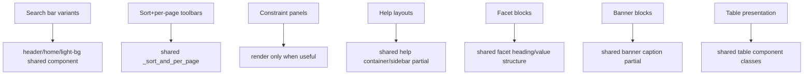

# Potential DOM Unification Candidates

Source basis: only `spec/capture-diff-output/port3000/**/CHANGES.md` notes.
Purpose: shortlist places where near-duplicate templates/partials may be unified to reduce repeated CSS.

## Candidate map

## Shortlist for investigation

| # | Priority | Candidate | CHANGES.md evidence | Likely DOM/partial unification target | CSS redundancy likely removable |
|---:|---|---|---|---|---|
| 1 | P1 | Unify search-bar markup variants | `aspie` fixes 2/8/9/11 call out same bug across `.search-bar--header`, `.search-bar--home`, `.search-bar--light-bg`; `bib_splash` says light-bg fix mirrors header fix; `dictionary_splash` repeats home-bar size/focus/select fixes; `quotes_splash` same light-bg input wrapper issue | Shared search form partial/component with variant tokens instead of three near-clones | Repeated selector blocks for focus ring, input-group spacing, mobile width, select sizing, button text sizing |
| 2 | P1 | Unify toolbar constraint rendering path | `bib_women` says visible chip comes from app partials (`catalog/_sort_and_per_page`, `bibliography/_sort_and_per_page`) and `catalog/_query_constraint`; `quote_search` had to add `quotes/_sort_and_per_page` mirroring bibliography | One shared `_sort_and_per_page` partial + one shared `_query_constraint` behavior | Divergent chip CSS/hide rules caused by different render paths |
| 3 | P1 | Unify `Current Filters` container behavior | `ab_search_noun_oe` fixes 1/2 add common desktop styling/padding for `#sidebar #appliedParams`; `quote_search` change 3 hides empty constraints panel when no facets | Shared constraints container partial logic: render only when facets/real constraints exist | Page-specific overrides for `.constraints-container` and `#appliedParams` exceptions |
| 4 | P1 | Unify help/about layout skeleton | `help_using` introduces shared `div.help-container > div` + `.help-sbar`; `help_about` explicitly switches DOM/classes to reuse help layout; `help_extended` confirms shared rules already drive layout | Common help-page wrapper partial used by help pages and about page | One-off class hacks (`about-sbar`) and repeated layout rescue CSS |
| 5 | P2 | Unify facet heading/value DOM structure | `a_search` common fixes for accordion panel bg/text/separator; `dictionary_non-headword` separate facet value padding/caret alignment fixes | Consolidate facet partial structure/class hooks across search contexts | Multiple facet-specific tweaks for accordion heading, value row spacing, chevrons |
| 6 | P2 | Unify advanced-search link policy in shared layer | `bib_splash` and `quote_search` each removed advanced link by controller config drift | Shared controller concern/base config for advanced-search visibility | Repeated per-controller fixes and related CSS/DOM cleanup |
| 7 | P3 | Unify banner caption block | `dictionary_splash` change 3 marks `.banner-text--caption` as COMMON and also present on splash banner | Shared banner partial with consistent caption class stack | Repeated banner caption overrides |
| 8 | P3 | Unify table markup classes | `help_extended` needed scoped `table caption` restyle; `bib_show` table styling fixes indicate table presentation divergence | Shared table partial/class convention for captions/striping | Global table overrides with specificity workarounds |

## Investigation checklist

1. Diff template trees for each P1 candidate.
2. Count repeated CSS selectors tied to candidate DOM variants.
3. Prototype shared partial for one P1 case (search bars first).
4. Re-run capture-diff on affected pages.
5. Confirm CSS deletions are net-negative and visual parity holds.

## Notes

- This is a discovery list, not implementation.
- Some differences are intentional BL9 modernization; validate before DOM changes.
