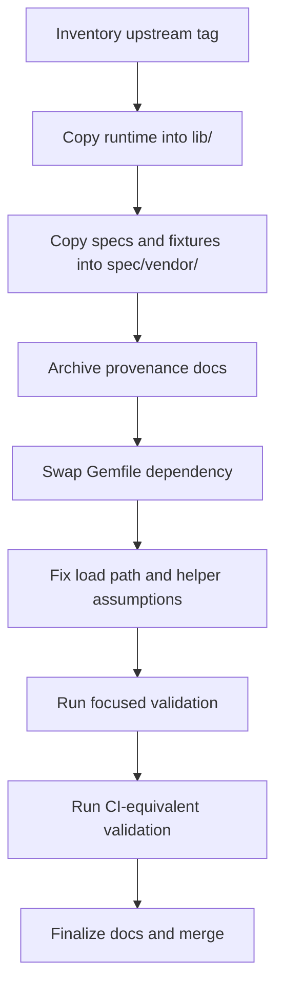

# Fold in `middle_english_dictionary` gem

## Goal

Move runtime source, tests, fixtures, and selected provenance artifacts from the external `middle_english_dictionary` gem (branch `main`) into this repo, so Dromedary owns MED domain code directly. Code is at /Users/dueberb/devel/mlibrary/middle_english_dictionary. 

## Why

- Remove runtime dependency on remote git gem checkout.
- Make MED code reviewable, editable, and testable in same repo as app.
- Keep `require "middle_english_dictionary"` behavior stable.

## Critique of prior plan (gaps fixed below)

1. File map had one runtime path mismatch:
   - expected: `lib/middle_english_dictionary/collection/external_dictionary_link_set.rb`
   - prior draft listed: `external_dictionary_link_set.rb` at top level.
2. No explicit provenance strategy (tag, commit SHA, manifest, and copy method).
3. No collision policy for support files (`Rakefile`, `Gemfile`, `Dockerfile`, `README.md`) that already exist in Dromedary root.
4. Validation lacked concrete command matrix and sequencing.
5. Rollback/sync strategy for post-merge upstream drift not defined.

## Current state (verified)

- `Gemfile` currently uses:
  - `gem "middle_english_dictionary", git: "https://github.com/mlibrary/middle_english_dictionary", tag: "v1.9.1"`
- Dromedary code already requires MED APIs from multiple paths (`lib/med_installer/**`, serializers, presenters, specs).
- Upstream MED project is available locally and via MCP (`middle_english_dictionary_ab`).
- Dromedary project is available via MCP (`dromedary_ab`).

## Non-goals

- Repackaging Dromedary itself as a gem.
- Refactoring MED API surface during migration.
- Reformatting upstream MED files beyond minimum compatibility fixes.

## Decision log

- Keep namespace and require path unchanged: `MiddleEnglishDictionary` and `require "middle_english_dictionary"`.
- Vendor only runtime + tests + fixtures into active paths; keep build/release support files in provenance archive path.
- Do not copy upstream root support files into repo root.

## Source-of-truth + provenance

- Upstream repo: `https://github.com/mlibrary/middle_english_dictionary`
- Upstream tag: `v1.9.1`
- Record exact commit SHA for that tag in a provenance note file.
- Add `vendor/middle_english_dictionary/UPSTREAM.md` containing:
  - source URL
  - tag
  - commit SHA
  - copied-at date
  - copy command(s)
  - local deviations (if any)

## Target layout

```text
lib/
  middle_english_dictionary.rb
  middle_english_dictionary/**
spec/
  vendor/
    middle_english_dictionary/**
vendor/
  middle_english_dictionary/
    UPSTREAM.md
    README.md
    CHANGELOG.md
    NOTES.md
    middle_english_dictionary.gemspec
```

## Canonical file map

### Runtime code -> `lib/`

- `lib/middle_english_dictionary.rb`
- `lib/middle_english_dictionary/version.rb`
- `lib/middle_english_dictionary/errors.rb`
- `lib/middle_english_dictionary/utilities.rb`
- `lib/middle_english_dictionary/xml_utilities.rb`
- `lib/middle_english_dictionary/external_dictionary_link.rb`
- `lib/middle_english_dictionary/bib.rb`
- `lib/middle_english_dictionary/bib/ms.rb`
- `lib/middle_english_dictionary/bib/ms_full.rb`
- `lib/middle_english_dictionary/bib/stencil.rb`
- `lib/middle_english_dictionary/collection/bib_set.rb`
- `lib/middle_english_dictionary/collection/entry_set.rb`
- `lib/middle_english_dictionary/collection/external_dictionary_link_set.rb`
- `lib/middle_english_dictionary/collection/hash_array.rb`
- `lib/middle_english_dictionary/collection/ms_names.rb`
- `lib/middle_english_dictionary/entry.rb`
- `lib/middle_english_dictionary/entry/bib.rb`
- `lib/middle_english_dictionary/entry/citation.rb`
- `lib/middle_english_dictionary/entry/class_methods.rb`
- `lib/middle_english_dictionary/entry/eg.rb`
- `lib/middle_english_dictionary/entry/note.rb`
- `lib/middle_english_dictionary/entry/orth.rb`
- `lib/middle_english_dictionary/entry/quote.rb`
- `lib/middle_english_dictionary/entry/sense.rb`
- `lib/middle_english_dictionary/entry/sensegrp.rb`
- `lib/middle_english_dictionary/entry/stencil.rb`
- `lib/middle_english_dictionary/entry/supplement.rb`

### Tests + fixtures -> `spec/vendor/middle_english_dictionary/`

- `middle_english_dictionary_spec.rb`
- `external_dictionary_link_spec.rb`
- `entry/entry_spec.rb`
- `entry/sense_spec.rb`
- `entry/eg_cite_spec.rb`
- `entry/etym_spec.rb`
- `spec_helper.rb`
- `data/bare_bones.xml`
- `data/simple_sense.xml`
- `data/well_rounded.xml`

### Provenance/support docs -> `vendor/middle_english_dictionary/`

- `README.md`
- `CHANGELOG.md`
- `NOTES.md`
- `middle_english_dictionary.gemspec`
- `UPSTREAM.md` (new)

### Explicitly excluded from copy

- Upstream root `Gemfile`, `Gemfile.lock`, `Rakefile`, `Dockerfile`, `docker-compose.yml`, `bin/*`, `.github/*`, `.rspec`, `.irbrc`, `.gitignore`

## Execution plan



### 1) Inventory and pin

- Resolve tag `v1.9.1` to commit SHA.
- Generate file manifest for runtime/spec/support buckets.
- Verify path parity between upstream and target tree.

### 2) Copy runtime code

- Copy all runtime files into `lib/` preserving relative paths.
- Confirm top-level `lib/middle_english_dictionary.rb` exists and requires subordinate files correctly.
- Ensure no Dromedary file shadows MED constants.

### 3) Copy tests and fixtures

- Copy upstream spec files and fixture XML under `spec/vendor/middle_english_dictionary/`.
- Add minimal shim in vendored `spec_helper.rb` only if required for path resolution.
- Keep upstream spec semantics unchanged where possible.

### 4) Add provenance archive

- Copy selected docs and gemspec into `vendor/middle_english_dictionary/`.
- Write `UPSTREAM.md` with source/tag/SHA/copy-date/deviations.

### 5) Switch dependency wiring

- Remove git gem line from `Gemfile`.
- Run `bundle install` and commit lockfile changes.
- Validate `require "middle_english_dictionary"` still resolves from local `lib/`.

### 6) Validate in layers

#### Layer A: MED vendored specs

- `bundle exec rspec spec/vendor/middle_english_dictionary`

#### Layer B: Dromedary MED touchpoints

- `bundle exec rspec spec/presenters/bibliography/index_presenter_spec.rb`
- `bundle exec rspec spec/system/view_structure_spec.rb spec/system/search_spec.rb`

#### Layer C: CI-equivalent smoke

- `bundle exec rake`

### 7) Closeout

- Update any docs mentioning MED as external runtime dependency.
- Add PR notes with:
  - copied file counts by bucket
  - upstream SHA
  - known deviations
  - rollback instructions

## Risks and mitigations

| Risk | Impact | Mitigation |
|---|---|---|
| Spec helper path assumptions break | Medium | Add local shim in vendored `spec_helper.rb`; avoid broad edits |
| Hidden require-order differences | High | Boot check + targeted MED touchpoint specs before full rake |
| Root file collisions from support artifacts | Medium | Keep support artifacts only under `vendor/middle_english_dictionary/` |
| Upstream drift post-migration | Low/Medium | Pin SHA in `UPSTREAM.md`; schedule periodic sync review |

## Rollback plan

- Revert migration commit(s).
- Restore gem dependency line in `Gemfile`.
- Run `bundle install`.
- Re-run MED touchpoint specs.

## Acceptance criteria

- MED runtime code lives in Dromedary `lib/` with stable namespace and require path.
- Vendored MED specs + fixtures exist and pass in new location.
- Provenance docs include source URL, tag, and commit SHA.
- `Gemfile` no longer depends on remote MED git gem.
- Dromedary rake/spec flow still passes for MED-related paths.

## Done when

- Source/tests/fixtures/provenance are in-repo and reviewed.
- External MED runtime dependency removed.
- Validation matrix passes.
- PR includes provenance and rollback notes.
