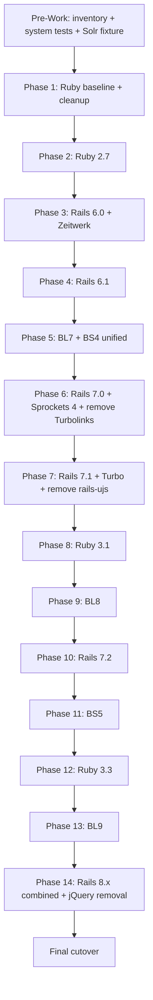

# Dromedary Upgrade Plan: Rails 5.2 / Blacklight 6 / Bootstrap 3 -> Rails 8.1 / Blacklight 9 / Bootstrap 5

Generated: 2026-05-28  
Revised: 2026-05-29 (critique incorporated)  
Researched from primary sources: rubygems.org, github.com/projectblacklight/blacklight, rubyonrails.org, getbootstrap.com

---

## Current State

| Component        | Version         | Notes                                                              |
|------------------|-----------------|--------------------------------------------------------------------|
| Ruby             | 2.x             | No .ruby-version pinned; production confirmed 2.x; `Dockerfile` has `ARG RUBY_VERSION=2.7.8` |
| Rails            | 5.2.8.1         | `config.load_defaults 5.1`                                        |
| Blacklight       | 6.15.0          | Pinned -- comment: "messed with auto-suggest code"                |
| Bootstrap        | 3.4.1           | Via `bootstrap-sass` pulled in transitively by BL6                |
| Sprockets        | 3.7.2           | **CVE-pinned** (CVE-2018-3760); upgrade unblocked in later steps  |
| JavaScript       | Turbolinks 5, jquery-rails                                                         |
| View layer       | BL6 partials    | Extensive custom overrides (see section below)                    |
| Test suite       | rspec-rails ~> 3.6, factory_bot_rails ~> 4.0                                      |
| Other pins       | puma =4.1.0, sqlite3 ~> 1.3.13, mysql2 < 0.5.0 (redis gem is commented out)  |

## Target State

| Component  | Version | Notes                                     |
|------------|---------|-------------------------------------------|
| Ruby       | 3.3.x   | BL9 minimum                               |
| Rails      | 8.1.x   | Highest BL9 supports (`>= 7.2, < 9`)      |
| Blacklight | 9.0.0   | ViewComponent 4.x; Bootstrap 5 required   |
| Bootstrap  | 5.3.x   | Required by BL9                           |
| Sprockets  | 4.x     | Stay on Sprockets; Propshaft migration is not mechanical (see Phase 6) |
| JavaScript | Turbo / importmap-rails (or jsbundling) | Hotwire stack       |

---

## Out of Scope

The following concerns are explicitly excluded from this document:

- Infrastructure and platform migrations (Kubernetes configuration, ingress, load balancer, observability/monitoring stack changes)
- Database migrations beyond what Blacklight's own generators produce
- New feature development during the upgrade window
- Third-party service integrations not already in the codebase
- Post-cutover observability tooling changes

Changes in any of these areas should be tracked in separate documents and coordinated to avoid conflicting with the upgrade branch.

---

## Branch Control and Freeze Policy

**Dedicated upgrade branch:** All upgrade work is performed on a single long-lived `upgrade` branch (or equivalent). Cherry-picks onto `main` are not permitted during the upgrade window.

**Full-process freeze on `main`:** No commits to `main` or any trunk branch are permitted while the upgrade is in progress. No production-fix exceptions. Any urgent production issues discovered during the upgrade window must be deferred until the final cutover, at which point the upgrade ships simultaneously.

**Branch model:**
- `upgrade` branch: long-lived, receives all phase commits
- `main`: frozen for the full duration of the upgrade
- No feature branches that target `main` during the upgrade window

---

## Lockfile Policy

- Commit `Gemfile.lock` at the end of every phase. The commit message should reference the phase (e.g., `"Phase 3: Rails 6.0 -- lockfile"`).
- CI must pass `bundle check` against the committed lockfile before a phase is considered complete.
- Do not add upper-bound version caps to Bundler or Rake in the Gemfile. These tools are not version-sensitive for this upgrade and pinning them creates unnecessary lockfile churn.
- The lockfile SHA at each phase boundary is the reproducible evidence artifact for that phase.

---

## Cutover Policy

- **Model:** Single final production deployment. No phased traffic rollout or gradual switch.
- **Timing:** Immediate full switch when readiness gates pass. No fixed maintenance window is pre-scheduled.
- **Smoke gate:** Critical user paths only (homepage, search, facets, show page, auto-suggest). Evaluated case-by-case at cutover time; no minimum numeric checklist size.
- **Pre-cutover validation:** Smoke test on the final artifact. If a staging environment is available, run the full smoke checklist on stage with the exact production artifact before cutting over to production.
- **Readiness gate:** Case-by-case evaluation. Confirmed readiness evidence and approval timestamp must be recorded before the final push.
- **Rollback:** Record the previous production Docker image SHA before cutover; keep it immediately available for rollback if a critical regression is discovered post-cutover.
- **Observability:** Runtime telemetry reviewed post-cutover for informational context only. Not a hard gate.

---

## Critical Pre-Work: Inventory Before Touching Anything

Before the first gem update, do the following:

### 1. Pin Ruby version

Add `.ruby-version` and `ruby '~> 2.x'` to Gemfile with the exact production version. All subsequent steps assume a known baseline.

### 2. The auto-suggest pin

`blacklight` is pinned at 6.15.0 with the comment _"They messed with the auto-suggest code, so we're stuck here for a while."_ The decision is to proceed with upgrades and fix auto-suggest behavior if it regresses. **Auto-suggest must be explicitly validated at every Blacklight major version boundary (6->7, 7->8, 8->9).** Before Phase 5, document the current expected behavior (endpoint URL, response format, typeahead JS behavior) as a manual regression checklist item and store a sample response payload -- this becomes the reference artifact for all subsequent BL upgrade gates.

### 3. Remove JRuby dead code, `@current_action` dead code, and debug leak

The Gemfile contains `if defined? JRUBY_VERSION` blocks that are no longer needed. Remove them during Phase 1 cleanup.

`@current_action` is set in `Dromedary::Catalog` (`"dictionary"`, `"bibliography"`, `"home"`), `StaticController` (`"about_med"`), and `ContactsController` (`"contact Us"`) but is **never read anywhere** -- no view, layout, partial, or helper consumes it. It is dead code. Remove all assignments as part of Phase 1 cleanup. This also eliminates the architectural concern about the concern's `index` override -- if `@current_action` is the only app-level reason for the override, removing it may allow `index` to be deleted from the concern entirely (deferring to BL's default `index`). Verify after removal whether the concern's `index`, `search`, `bib`, and `home` methods have any remaining non-BL-default behavior.

`app/models/search_builder.rb` line 42 has `solr_params["debug"] = "true"` accidentally left inside `escape_intersticial_parens`. This causes every search request with a `q` parameter to send `debugQuery=true` to Solr in production, inflating response payloads. Remove this line during Phase 1 cleanup.

### 4. Custom Blacklight Ruby overrides

The app has **three separate Blacklight controllers**, each with its own `blacklight_config` and presenter subclass:

| Controller | URL prefix | IndexPresenter | Notes |
|---|---|---|---|
| `CatalogController` | `/dictionary` | `Dromedary::IndexPresenter` | Headwords, POS/discipline/etyma facets |
| `BibliographyController` | `/bibliography` | `Dromedary::Bib::IndexPresenter` | Bib records, LALME/LAEME facets; `show` redirects HYP* IDs |
| `QuotesController` | `/quotations` | `Dromedary::Quotes::IndexPresenter` | Quotations, no facets |

All three include `Dromedary::Catalog` (from `concerns/catalog.rb`) which provides the shared `index`, `search`, `bib`, and `home` actions. Any BL API fix to the shared concern fixes all three simultaneously.

ViewComponent migration in Phases 9 and 13 must be applied in **all three controllers' configs**, not just `CatalogController`.

The following files override BL internals and need verification at **every** BL major version boundary:

| File                                            | Risk                                                       |
|-------------------------------------------------|------------------------------------------------------------|
| `app/presenters/blacklight/index_presenter.rb`  | **This is a BL6 source copy that SHADOWS `Blacklight::IndexPresenter` at runtime.** It is NOT a subclass -- it reopens and replaces the gem's class. It has `deprecation_horizon = "Blacklight version 7.0.0"` (BL6 itself flagged it for removal). Must be **deleted** in Phase 5. The three app presenters (`Dromedary::IndexPresenter`, `Dromedary::Bib::IndexPresenter`, `Dromedary::Quotes::IndexPresenter`) all use `SimpleDelegator` wrapping `Blacklight::IndexPresenter` -- they are NOT subclasses and their app-specific domain methods are BL-version-independent. |
| `app/helpers/blacklight/layout_helper_behavior.rb` | **Shadow copy**, same pattern as `index_presenter.rb` -- reopens and replaces BL's module. Contains BS3 grid classes (`col-xs-12`, `col-md-push-3`, `col-sm-push-4`) that must be updated or removed in Phase 5. `col-xs-*` is removed in BS4 (use `col-*`); `col-md-push-*` is removed in BS4 (use `order-*` or restructure). Either update to BS4 classes, or delete and let BL7's version take over. |
| `app/controllers/catalog_controller.rb`        | `#show`, `#suggest` API changed across BL7/8/9. `BibliographyController#show` (HYP*->BIB* redirect) is safe -- it calls `super` and never touches `SearchService#fetch` directly. |
| `app/controllers/concerns/catalog.rb`          | Shared by all three controllers; BL API changes affect all three simultaneously |
| `app/models/search_builder.rb`                 | Proper subclass (not a shadow copy). 4 custom processor chain steps using the stable `solr_params` hash API -- should work across BL7/8/9 without changes. **Bug**: `solr_params["debug"] = "true"` at line 42 is accidentally left inside `escape_intersticial_parens`, causing every search request with a `q` param to hit Solr with debug output enabled in production. Fix in pre-work. |
| `app/models/solr_document.rb`                  | Minimal -- `include Blacklight::Solr::Document` + two extensions. `use_extension(Blacklight::Document::Email)` at line 9 must be removed in Phase 13 (`Document::Email` removed in BL9). `use_extension(Blacklight::Document::DublinCore)` should remain. SMS extension already commented out. |

### 5. View overrides

`app/views/catalog/original_blacklight_views/` contains developer reference copies of BL6 originals. These are **not active** and do not affect rendering. Ignore them.

The following custom BL partials ARE active

**app/views/catalog/**
- `index.html.erb`, `_document.html.erb`, `_document_list.html.erb`
- `_per_page_widget.html.erb`, `_sort_widget.html.erb`
- `_constraints_element.html.erb`
- `_show_default.html.erb`, `_show_header_default.html.erb`
- `_index_default.html.erb`, `_related_entries.html.erb`
- `print.html.erb`, `404.html.erb`

These files override Blacklight's own partials. When BL replaces a partial with a ViewComponent, your override silently stops being used -- the component renders instead. This is the single largest migration risk in the entire upgrade.

### 6. Write a minimal system test suite (mandatory, do before Phase 5)

The existing test suite has no feature or system specs. Bootstrap class renames and ViewComponent migrations have zero automated coverage. The manual regression checklist is the only safety net, and it only catches what you think to put on it.

An agent can implement this autonomously: the routes file, existing controller specs, and view files contain sufficient information to derive selectors and assertions. No human input is needed.

Add `gem 'capybara'` and `gem 'selenium-webdriver'` (already in lock file) to the test group, configure a system spec helper, and write specs covering the manual regression checklist paths:

```ruby
# spec/system/search_spec.rb
# - homepage loads without error
# - search form submits and returns results
# - a result document renders with expected fields
# - facet filter applies and updates results
# - per-page selector changes result count
# - sort selector changes result order
# - pagination next/prev works
# - show/detail page loads for a known document
# - 404 page renders for unknown document
# - auto-suggest fires on search input (endpoint responds)
# - bibliography index loads
# - print view renders
```

**Deterministic data setup:** System specs must use a checked-in Solr fixture snapshot with stable document IDs and facet values. A load task provisions the snapshot before specs run. This prevents flaky tests caused by live Solr state differences across environments. Store the snapshot in `spec/fixtures/solr/` and document the load command in the spec helper.

These tests do not need to assert exact HTML -- they need to assert that pages load, key elements are present, and interactions don't error. That is enough to catch the class of regression introduced by Bootstrap and ViewComponent migrations.

**Scope:** 10-15 specs, driven by the manual checklist. This investment pays off across every subsequent BL and Bootstrap phase boundary.

---

## Dependency Upgrade Path

The path requires 14 phases. Each phase ends with a passing test suite before proceeding.

```
Ruby:       unknown -> 2.7 -> 3.1 -> 3.3
Rails:      5.2 -> 6.0 -> 6.1 -> 7.0 -> 7.1 -> 7.2 -> 8.0 -> 8.1
Blacklight: 6.15 -> 7.x -> 8.12.3 -> 9.0.0
Bootstrap:  3.4.1 -> 4.x -> 5.3.x
Sprockets:  3.7.2 -> 4.x (Phase 6)
Turbolinks: 5 -> removed (Phase 6) -> Turbo/Hotwire added (Phase 7)
```

Version compatibility matrix:

| BL version | Rails         | Ruby   | Bootstrap |
|------------|---------------|--------|-----------|
| 6.x        | >= 5.0        | >= 2.3 | 3.x       |
| 7.x        | >= 5.1, < 7.2 | >= 2.7 | 4.x (5.x optional) |
| 8.x        | >= 6.1, < 9   | >= 2.7 | 4.x or 5.x |
| 9.x        | >= 7.2, < 9   | >= 3.3 | 5.x required |

### Dependency graph



## Phase Ordering Logic

This section documents why phases are sequenced as they are. Each gate is a hard constraint unless noted. Understanding these constraints allows an agent to evaluate whether phases can be reordered, combined, or skipped.

### Hard gates (cannot be reordered)

| Constraint | Forces order |
|-----------|-------------|
| BL7 requires `rails < 7.2` | BL7->BL8 (Phase 9) MUST happen before Rails 7.2 (Phase 10) |
| BL8 requires `rails >= 6.1` | Rails must reach 6.1 (Phase 4) before BL8 can be installed |
| BL9 requires `rails >= 7.2` | Rails 7.2 (Phase 10) MUST happen before BL9 (Phase 13) |
| BL9 requires `ruby >= 3.3` | Ruby 3.3 (Phase 12) MUST happen before BL9 (Phase 13) |
| BL9 requires Bootstrap 5 | BS4->5 (Phase 11) MUST happen before BL9 (Phase 13) |
| Rails 7.2 requires `ruby >= 3.1` | Ruby 3.1 (Phase 8) MUST happen before Rails 7.2 (Phase 10) |
| `turbo-rails ~> 2.0` requires `actionpack >= 7.1.0` | Turbo cannot be added until Rails 7.1 (Phase 7); only Turbolinks removal happens in Phase 6 |
| BL7 ships BS4 views; BL6 gem provides BS3 Sass | BS3->BS4 migration MUST be done simultaneously with BL6->BL7 (Phase 5); BL7 has no BS3 Sass, BL6 has no BS4 views |
| Sprockets 3 CVE pin (`= 3.7.2`) | Sprockets 4 cannot be adopted until the CVE pin is intentionally released; Phase 6 is the first Rails upgrade that defaults to Sprockets 4 |

### Why incremental Rails hops (5.2 -> 6.0 -> 6.1 -> 7.0 -> 7.1 -> 7.2 -> 8.0 -> 8.1)

Skipping Rails major versions is not supported by the Rails upgrade path. `bin/rails app:update` only applies one version's framework defaults at a time. `config.load_defaults N.x` settings accumulate; each version's new defaults must be verified independently. The Rails guides and convention explicitly require stepping through each major/minor version.

**Config drift strategy for `bin/rails app:update`:** Every Rails major hop produces conflicts in `config/environments/*.rb`, `config/initializers/`, and `config/application.rb`. Apply a consistent policy:

- **Auto-accept upstream** for Rails-managed files unless you have an intentional override documented (e.g., `config/environments/production.rb` security headers).
- **Manual review required** for `config/application.rb`, `config/routes.rb`, and any initializer with app-specific logic.
- Commit the reviewed result immediately with a `[app:update]` tag in the commit message so the diff is attributable to the Rails upgrade rather than mixed with app changes.

### Why Ruby hops incrementally (2.x -> 2.7 -> 3.1 -> 3.3)

- **2.x -> 2.7**: Ruby 2.7 surfaces all keyword-argument separation warnings as `Warning`s. Fixing them on 2.7 prevents them from becoming hard errors on 3.0. BL7 requires `>= 2.7`; this is the minimum step to unlock BL7.
- **2.7 -> 3.1**: Rails 7.2 requires `>= 3.1`. Skipping from 2.7 to 3.3 is higher risk -- 3.0 broke kwargs, 3.1 changed YAML/Psych behavior, 3.2 changed `Data.define` and encoding. Stopping at 3.1 ensures Rails 7.2 compatibility is achieved with minimal Ruby-change surface.
- **3.1 -> 3.3**: BL9 requires `>= 3.3`. 3.2 and 3.3 are behaviorally stable relative to 3.1; combining them into one hop is reasonable but can be split if needed.

### Why BL6->7 is combined with BS3->4 (Phase 5)

BL7 does not ship Bootstrap 3 Sass partials -- it ships only Bootstrap 4 views. BL6 provides BS3 via `bootstrap-sass`. When you swap the gem from BL6 to BL7, the Bootstrap asset supply changes simultaneously. There is no intermediate state where you can run BL6 with BS4 or BL7 with BS3 without significant monkey-patching. The two migrations must be done in the same phase.

### Why BL7->8 is done before Rails 7.2 (Phases 9, 10)

BL7 declares `rails < 7.2` in its gemspec. Installing Rails 7.2 while BL7 is locked would cause a Bundler conflict. BL8 declares `rails >= 6.1, < 9`, which admits Rails 7.2. Therefore the path is: BL7->BL8 first, then Rails 7.1->7.2.

### Why BS4->5 is done before BL9, not simultaneously (Phases 11, 13)

BL8 supports both Bootstrap 4 and Bootstrap 5. BL9 requires Bootstrap 5. Migrating Bootstrap while on BL8 isolates Bootstrap-related regressions (class renames, `data-bs-*` attributes, removed components) from BL9-related regressions (ViewComponent API changes, removed partials, CSS custom properties). If both were done simultaneously, any visual regression would be attributable to either change and would be difficult to bisect.

### Why BL9 is done before Rails 8.x (Phases 13, 14)

Both BL8 and BL9 support `rails < 9` (i.e., 8.x). Either order is technically valid. The plan upgrades BL9 on Rails 7.2 (the minimum BL9 supports) rather than on Rails 8.x, on the principle of changing one major axis at a time. A passing BL9 baseline on Rails 7.2 gives high confidence before adding Rails 8.x changes.

### Why Sprockets 4 is adopted in Phase 6 (not earlier)

The app has Sprockets pinned to `= 3.7.2` by CVE-2018-3760. This pin blocks any Sprockets upgrade. Releasing the pin is an intentional security decision. Phase 6 (Rails 7.0 upgrade) is the right moment because: (a) Rails 7.0 defaults to Sprockets 4 and the upgrade tooling (`bin/rails app:update`) assumes it; (b) `app/assets/config/manifest.js` already exists in Sprockets-4 format, so the migration work is minimal; (c) earlier phases (5 and below) have no urgent need for Sprockets 4 features.

### Why Rails 8.0 and 8.1 are combined (Phase 14)

By Phase 14, BL9 is installed and the view/asset layer is stable. Rails 8.0 and 8.1 have no BL or Bootstrap interaction. There is no hard gate between them. If regressions appear, they can be bisected by testing at the 8.0 intermediate state using `config.load_defaults 8.0` before advancing to 8.1 -- the defaults checkpoint provides bisection without requiring a separate phase up front.

---

## Phase 1: Establish Ruby Baseline

**Effort:** S (0.5 day)  
**Goal:** Known Ruby version, clean Gemfile, tests green.  
**Why first:** Every subsequent step gates on Ruby version. Gem compatibility tables, `required_ruby_version` declarations, and kwarg deprecation behavior are all Ruby-version-dependent. Starting without a pinned, known Ruby version means any failure is ambiguous. This phase has zero compatibility risk -- it changes nothing functional.

**Prerequisite inputs:** Production Ruby version confirmed from running environment; Gemfile in its current state.

### Actions

1. Determine current Ruby: `ruby --version` on each environment.
2. Create `.ruby-version` pinned to that version (minimum 2.3 for current state).
3. Add `ruby '~> X.Y'` to `Gemfile`.
4. Run `bundle` to verify lock file matches.
5. Run `rspec` -- capture baseline passing/failing count.

### Also fix at this step

- Remove `if defined? JRUBY_VERSION` blocks from Gemfile (confirmed dead code).
- Remove all `@current_action` assignments from controllers and concerns (confirmed dead code -- never read in any view, layout, or helper; see Pre-Work item 3).
- Remove `solr_params["debug"] = "true"` from `app/models/search_builder.rb` line 42 (Solr debug leak; see Pre-Work item 3).

### Phase Exit Criteria

Before advancing to Phase 2:

- [ ] `bundle exec rspec` passes (capture baseline count; document any pre-existing failures)
- [ ] `bundle check` succeeds against committed lockfile
- [ ] `.ruby-version` file committed
- [ ] No `JRUBY_VERSION` guards remain: `rg 'JRUBY_VERSION' Gemfile`
- [ ] No `@current_action` assignments remain: `rg '@current_action' app/`
- [ ] No debug leak: `rg 'solr_params\["debug"\]' app/`
- [ ] Runtime telemetry reviewed (informational only)
- [ ] Exit artifacts saved: `Gemfile.lock` SHA, baseline RSpec report

---

## Phase 2: Ruby -> 2.7

**Effort:** S (0.5-1 day)  
**Goal:** Ruby 2.7.x installed and confirmed. No test regressions.  
**Why 2.7 (not 3.x directly):** Ruby 2.7 is the minimum required by BL7 (Phase 5). More importantly, Ruby 2.7 surfaces keyword-argument separation issues as warnings (`-W:deprecated`) rather than hard errors. Fixing these warnings on 2.7 before proceeding to Ruby 3.x prevents them from exploding as `ArgumentError`s mid-upgrade. Jumping from an unknown 2.x directly to 3.x combines two risky axes (Ruby major version + kwarg errors) into a single hard-to-diagnose state.

**Prerequisite inputs:** `.ruby-version` pinned (Phase 1 complete).

### Actions

1. Update `.ruby-version` to `2.7.x` (latest 2.7 patch).
2. Update `Gemfile` ruby declaration.
3. **Update `Dockerfile`:** The root `Dockerfile` has `ARG RUBY_VERSION=2.7.8` hard-coded. Update this to match the new `.ruby-version` value. Also check `BUNDLER_VERSION` arg -- ensure it matches the bundler version in `Gemfile.lock`. This Docker rebuild is required for CI/CD and Kubernetes deployments.
4. `bundle install` -- fix any gems that require native extension rebuilds.
5. Run tests. Address any Ruby 2.7 keyword argument warnings (these become errors in Ruby 3.0). The Rails 5.2 era has extensive `**options` patterns.

**Note:** Ruby 2.7 emits deprecation warnings for positional-to-keyword argument coercion. Fix them now -- they are hard errors in Ruby 3. Use `RUBYOPT="-W:deprecated"` to surface all of them.

### Phase Exit Criteria

Before advancing to Phase 3:

- [ ] `bundle exec rspec` passes (zero new failures vs. Phase 1 baseline)
- [ ] Zero keyword argument warnings: `RUBYOPT="-W:deprecated" bundle exec rspec 2>&1 | grep -E "warning.*keyword"`
- [ ] `Dockerfile` updated and rebuilt successfully
- [ ] `bundle check` succeeds against committed lockfile
- [ ] Runtime telemetry reviewed (informational only)
- [ ] Exit artifacts saved: `Gemfile.lock` SHA, `.ruby-version` (2.7.x), `Dockerfile` updated, kwarg warning cleanup log

---

## Phase 3: Rails 5.2 -> 6.0

**Effort:** M (1-2 days)  
**Prerequisites:** Ruby >= 2.5 (you have 2.7)  
**Why before BL7:** BL7 requires `ruby >= 2.7` (satisfied) and `rails >= 5.1` (technically allows upgrading BL7 on Rails 5.2). However, Rails 6.0 introduces Zeitwerk autoloading, which must be resolved before adding the complexity of a BL major upgrade. Resolving Zeitwerk on known-good BL6 is far easier than debugging a Rails + BL + autoloading triple failure. Also, BL8 requires `rails >= 6.1`; getting Rails to 6.1 first means the BL6->7->8 sequence does not also require a simultaneous Rails upgrade.

**Prerequisite inputs:** Phase 2 complete (Ruby 2.7, kwarg warnings resolved); `Gemfile.lock` committed.

### Actions

1. In Gemfile: `gem 'rails', '~> 6.0'`
2. `bundle update rails`
3. Run `bin/rails app:update` -- review each conflict using the config drift strategy documented in Phase Ordering Logic.
4. Set `config.load_defaults 6.0` in `application.rb`.

### Key changes to handle

- **Zeitwerk autoloader**: Rails 6 switches from classic to Zeitwerk autoloading by default. The app uses `config.load_defaults 5.1` which keeps classic autoloading, but you should migrate. Audit all `require_dependency` calls in the codebase -- Zeitwerk does not need them and will warn. File names must match class names exactly (snake_case file = CamelCase class).
- **Action Mailbox / Action Text**: These are new frameworks pulled in but not activated by default. Ensure the `active_storage.service` configuration key exists in `config/storage.yml` (the generator creates it).
- **npm packages renamed**: `actioncable` -> `@rails/actioncable`, `activestorage` -> `@rails/activestorage`, `rails-ujs` -> `@rails/ujs`. This applies only if using Webpack/importmap. This app uses Sprockets with the `rails-ujs` Ruby gem (`//= require rails-ujs`); that gem is dropped entirely in Phase 7 when Turbo is added. No action here.
- **Webpacker** is now the default JS bundler in new apps but is not forced on existing apps. You currently use Sprockets. Do NOT add Webpacker unless intentional -- it will complicate the Sprockets migration later.
- **Cookie metadata**: Rails 6 embeds purpose/expiry in cookies. If you have a rolling deploy, set `config.action_dispatch.use_cookies_with_metadata = false` during the transition.

### Phase Exit Criteria

Before advancing to Phase 4:

- [ ] `bundle exec rspec` passes
- [ ] `RAILS_ENV=production bundle exec rails assets:precompile` succeeds
- [ ] `RAILS_ENV=production bundle exec rails zeitwerk:check` passes
- [ ] `bundle check` succeeds against committed lockfile
- [ ] `bin/rails app:update` diff reviewed and committed with `[app:update]` tag
- [ ] Runtime telemetry reviewed (informational only)
- [ ] Exit artifacts saved: `Gemfile.lock` SHA, Rails 6.0 RSpec report, Zeitwerk check output

---

## Phase 4: Rails 6.0 -> 6.1

**Effort:** S (1 day)  
**Prerequisites:** Phase 3 complete  
**Why before BL7:** BL8 requires `rails >= 6.1`. If BL7 were installed on Rails 6.0, the subsequent BL7->BL8 upgrade would require a simultaneous Rails upgrade. Reaching Rails 6.1 now means BL7 and BL8 can both be installed without changing the Rails constraint at the BL upgrade boundary.

**Prerequisite inputs:** Phase 3 complete; Zeitwerk check passing; `Gemfile.lock` committed.

### Actions

1. In Gemfile: `gem 'rails', '~> 6.1'`
2. `bundle update rails`
3. Run `bin/rails app:update` -- apply config drift strategy
4. Set `config.load_defaults 6.1`

### Key changes to handle

- **Zeitwerk as default**: If you deferred switching in Phase 3, switch now. Set `config.autoloader = :zeitwerk` if not already set by `load_defaults 6.1`.
- **ActiveRecord connection handling**: `connection_handling` API changed. If you use any multi-database setup, audit.
- **`where` with associations**: Some query behavior changed; run your full test suite and watch for SQL changes.
- **`assert_response` in tests**: Some test helper changes. Watch for deprecations in rspec-rails.
- **`has_many through:` with scope**: Behavior changed in edge cases.

### Phase Exit Criteria

Before advancing to Phase 5:

- [ ] `bundle exec rspec` passes
- [ ] `RAILS_ENV=production bundle exec rails zeitwerk:check` passes
- [ ] `bundle check` succeeds against committed lockfile
- [ ] `bin/rails app:update` diff reviewed and committed
- [ ] Runtime telemetry reviewed (informational only)
- [ ] Exit artifacts saved: `Gemfile.lock` SHA, Rails 6.1 RSpec report

---

## Phase 5: Blacklight 6 -> 7 (with Bootstrap 3 -> 4)

**Effort:** L (3-5 days)  
**Prerequisites:** Rails 6.1, Ruby >= 2.7  
**BL7 latest stable:** 7.41.0  
**Reference:** https://github.com/projectblacklight/blacklight/wiki/Upgrade-guide  
**Why Bootstrap migration is combined with BL upgrade:** BL7 does not ship Bootstrap 3 Sass. The `bootstrap-sass` gem (BS3) was a transitive dependency of BL6 -- when BL6 is replaced by BL7, Bootstrap 3 Sass goes away simultaneously. BL7 views are written for Bootstrap 4. There is no intermediate state of "BL7 with BS3" or "BL6 with BS4" that works without significant custom scaffolding. The two must be done together.

This is the largest single phase in the upgrade. It combines:
- BL6 partial-based rendering -> BL7 ViewComponent introduction
- Bootstrap 3 -> Bootstrap 4

**Prerequisite inputs:** Phase 4 complete; system tests and Solr fixture snapshot in place (Pre-Work item 6); auto-suggest behavior documented and sample response stored (Pre-Work item 2).

### 5a: Bootstrap 3 -> 4 (asset side)

BL7 ships with Bootstrap 4 views. The `bootstrap-sass` gem (BS3) must go.

1. Remove `gem 'bootstrap-sass'` from Gemfile (it will disappear as a BL6 transitive dependency).
2. Add `gem 'bootstrap', '~> 4.6'` (the `bootstrap` gem, not `bootstrap-sass`).
3. In `app/assets/stylesheets/blacklight.scss`, update the Bootstrap import block:
   ```scss
   // Remove this line (BS3-only, does not exist in BS4):
   @import 'bootstrap-sprockets';

   // These two lines stay:
   @import 'bootstrap-variables';
   @import 'bootstrap';
   ```
4. Bootstrap 4 requires Autoprefixer. Add `gem 'autoprefixer-rails'` if not already present.

### 5b: Bootstrap 3 -> 4 Sass variable migration

`app/assets/stylesheets/bootstrap-variables.scss` overrides Bootstrap Sass variables. Many variable names changed between BS3 and BS4. The variables currently used require the following migrations:

| Variable (BS3 name)         | BS4 equivalent                                           | Action                             |
|-----------------------------|----------------------------------------------------------|------------------------------------|
| `$text-color`               | `$body-color`                                            | Rename                             |
| `$btn-default-color`        | Removed (no direct equivalent)                           | Delete; style via `.btn-secondary` |
| `$padding-base-vertical`    | `$input-btn-padding-y`                                   | Rename                             |
| `$padding-base-horizontal`  | `$input-btn-padding-x`                                   | Rename                             |
| `$brand-primary`            | `$primary` (or override via `$theme-colors` map)         | Rename (currently commented out)   |
| `$body-bg`                  | `$body-bg` (unchanged)                                   | No change                          |
| `$link-color`               | `$link-color` (unchanged)                                | No change                          |
| `$link-active-color`        | `$link-hover-color`                                      | Rename                             |
| `$highlight-color`          | App-defined variable; no Bootstrap meaning               | No change (app CSS still works)    |

App-specific variables (`$navbar-bgcolor`, `$footer-bgcolor`, `$header-bgcolor`, `$body-bgcolor`, `$image-viewer-bgcolor`, etc.) are not Bootstrap variables -- they are used by the app's own Sass rules. They do not need renaming, but verify each is still referenced correctly after the Bootstrap gem change.

**`!default` flags on overrides:** Variables in `bootstrap-variables.scss` that carry `!default` (e.g., `$text-color: #4a4a4a !default`) will still override Bootstrap because the file is imported before Bootstrap. The `!default` here is redundant but harmless. Remove the flags for clarity.

The Sass import order in `blacklight.scss` must be:
```scss
@import 'bootstrap-variables';   // 1. your overrides (no !default)
@import 'bootstrap';             // 2. Bootstrap uses them
```

**`@import 'blacklight/blacklight'` in `blacklight.scss`:** This import is BL's own Sass entry point and remains valid through BL7 and BL8. The path does not change.

**`@import 'blacklight/blacklight'` in `bibliography.scss`:** Same -- this import remains valid through BL8.

**BL9 note:** BL9 drops the Sass-variable approach entirely in favor of CSS custom properties. The variables migrated here will need a further migration in Phase 13. See Phase 13 for details.

**Internal check -- assets (after 5a and 5b):**
- [ ] `RAILS_ENV=production bundle exec rails assets:precompile` succeeds with the new Bootstrap gem
- [ ] No Sass variable name errors in compile output
- [ ] The `@import 'bootstrap-variables'` + `@import 'bootstrap'` order resolves without errors

### 5c: Bootstrap 3 -> 4 HTML/CSS changes

Every custom view and layout partial that uses Bootstrap classes needs auditing. Major class renames:

| Bootstrap 3              | Bootstrap 4                        |
|--------------------------|------------------------------------|
| `panel`                  | `card`                             |
| `panel-default`          | `card`                             |
| `panel-heading`          | `card-header`                      |
| `panel-body`             | `card-body`                        |
| `well`                   | (removed; use `card` or custom)    |
| `thumbnail`              | `card`                             |
| `label`                  | `badge`                            |
| `btn-default`            | `btn-secondary`                    |
| `pull-left`              | `float-left`                       |
| `pull-right`             | `float-right`                      |
| `hidden-xs/sm/md/lg`     | `d-none d-sm-block` etc.           |
| `visible-xs/sm/md/lg`    | `d-block d-sm-none` etc.           |
| `navbar-default`         | `navbar-light bg-light`            |
| `navbar-toggle`          | `navbar-toggler`                   |
| `nav navbar-nav`         | `navbar-nav`                       |
| `col-xs-*`               | `col-*` (xs is the default tier)   |
| `input-sm/lg`            | `form-control-sm/lg`               |
| `glyphicon-*`            | Removed entirely -- use Font Awesome or SVG icons |
| `breadcrumb > li`        | `breadcrumb-item`                  |

**Glyphicons removal is high-impact.** If any BL6 views use `glyphicon-*` (search icon, clear icon, etc.), replace them. BL7 uses Font Awesome by default (via `font-awesome-rails` or the npm package). Audit all templates for `glyphicon`.

Files to audit:
- `app/views/catalog/` (all partials)
- `app/views/bibliography/` (all partials)
- `app/views/quotes/` (all partials)
- `app/views/layouts/`

**Internal check -- view class renames (after 5c):**
- [ ] No `col-xs-*` or `glyphicon-*` references remain in active view files: `rg 'col-xs-|glyphicon' app/views/`
- [ ] No BS3-only classes remain: `rg 'panel-default|btn-default|pull-left|pull-right' app/views/`

### 5d: BL6 -> BL7 gem upgrade

1. In Gemfile: `gem 'blacklight', '~> 7.41'`
2. Remove the version pin comment.
3. `bundle update blacklight`
4. **RSolr note:** BL7 requires RSolr >= 2.0 (BL6 used RSolr ~> 1.0). RSolr 2.0 changed response handling, but an audit of this app found **zero direct RSolr or `@response[...]` usage** in app code. RSolr is purely a transitive BL dependency here -- the upgrade to RSolr 2.x will happen automatically via `bundle update blacklight`. No app code changes needed for RSolr.
5. Run `bin/rails blacklight:install` -- review the generated changes (do NOT overwrite your customizations blindly).

**Internal check -- BL gem (after 5d):**
- [ ] `bundle exec rspec` passes with BL7 installed
- [ ] `bundle check` succeeds
- [ ] BL migrations applied: `bin/rails db:migrate:status` shows no pending BL migrations (or they have been run)

### 5e: BL7 view and controller changes

**ViewComponents introduced (but partials still functional):**
BL7 introduces ViewComponents but most BL6 partials still work. However, some partials are deprecated. The risk is that the default rendering now goes through components, so your partial overrides in `app/views/catalog/` may be bypassed for newly-componentized elements.

Check each of your catalog overrides against the BL7 changelog to see if the partial was moved to a component.

**`catalog_controller.rb` changes:**
- `add_facet_field ... component: true` -- the `component: true` option was added in BL7 for facets that render as components. If you have custom facet fields, check your `add_facet_field` calls.
- `CatalogController#search_service` -- verify method signature.

**`concerns/catalog.rb` changes:**
- The `Blacklight::Catalog` concern had methods reorganized. Compare your override against BL7 source: https://github.com/projectblacklight/blacklight/blob/release-7.x/app/controllers/concerns/blacklight/catalog.rb

**`presenters/blacklight/index_presenter.rb` -- DELETE THIS FILE:**
`app/presenters/blacklight/index_presenter.rb` is a complete copy of BL6's `Blacklight::IndexPresenter` source. At runtime it reopens and shadows the gem's class, replacing all of BL's `IndexPresenter` behavior with the BL6 version. The file itself sets `deprecation_horizon = "Blacklight version 7.0.0"` -- BL6 was explicitly warning this class was being replaced in BL7.

**Delete this file and its spec.** `spec/presenters/blacklight/index_presenter_spec.rb` is an empty file (0 lines) -- delete it too. After deletion, BL7's actual `Blacklight::IndexPresenter` will load from the gem.

The three app presenters (`Dromedary::IndexPresenter`, `Dromedary::Bib::IndexPresenter`, `Dromedary::Quotes::IndexPresenter`) all use `SimpleDelegator`, wrapping `Blacklight::IndexPresenter` via `__setobj__`. Their constructors are `initialize(document, view_context, configuration = view_context.blacklight_config)` -- the same 3-arg signature as BL7/8. Their app-specific methods (XSLT transforms, MED domain object hydration) are pure domain logic that does not call any BL `IndexPresenter` methods and will continue to work after the deletion.

**Blacklight database migrations:**
BL ships AR migrations for its `bookmarks` and `searches` tables. After `bundle update blacklight`, check for pending migrations:
```bash
bin/rails db:migrate:status
bin/rails db:migrate
```
BL7 does not change the schema from BL6, but verify no new migrations appeared.

**Auto-suggest (BL6->BL7 gate):**
BL7 changed the suggest endpoint and the `blacklight_suggest` route. Compare your custom suggest code against https://github.com/projectblacklight/blacklight/blob/release-7.x/app/controllers/concerns/blacklight/suggest.rb and validate the endpoint response against the pre-work documentation artifact.

**`helpers/blacklight/layout_helper_behavior.rb` -- UPDATE OR DELETE:**
`app/helpers/blacklight/layout_helper_behavior.rb` reopens and shadows BL's `Blacklight::LayoutHelperBehavior` module with BS3-specific grid classes. All methods use Bootstrap 3 classes that do not exist in BS4:

| Method | Current (BS3) | BS4 replacement |
|--------|---------------|-----------------|
| `main_content_classes` | `col-md-9 col-sm-8 col-xs-12` | `col-md-9 col-sm-8 col-12` |
| `sidebar_classes` | `col-md-3 col-sm-4 col-xs-12` | `col-md-3 col-sm-4 col-12` |
| `title_content_classes` | `col-md-push-3 col-sm-push-4` | **No direct equivalent** -- BS4 uses flexbox ordering (`order-md-last`) or float-based alternatives |

Option A: Delete this file. BL7 ships its own updated `LayoutHelperBehavior` with BS4 classes. If the custom grid layout matches BL7 defaults, this is the simplest path.

Option B: Update the classes. Replace `col-xs-*` with `col-*`. For the `col-md-push-*` pattern (used in `title_content_classes` with the `offset` parameter to `main_content_classes`), inspect whether the offset/push behavior is actually used in any template and either remove it or replace with BS4 ordering utilities.

**Recommended**: Do NOT delete this file -- `main_content_classes` and `sidebar_classes` are called in 30+ active views across `catalog/`, `bibliography/`, `quotes/`, `static/`, `contacts/`, and `application/`. The file is essential. However:

- `main_content_classes(offset: true)` is never called anywhere -- the `offset:` branch is dead code.
- `title_content_classes` is never called anywhere -- dead code.

Action: Update the file in place. Replace `col-xs-*` with `col-*`, remove or ignore the unused `offset:` branch and `title_content_classes` method.

### Phase Exit Criteria

Before advancing to Phase 6:

- [ ] `bundle exec rspec` passes
- [ ] System specs pass (all Pre-Work checklist paths green)
- [ ] `RAILS_ENV=production bundle exec rails assets:precompile` succeeds
- [ ] No `col-xs-*` or `glyphicon-*` remaining in active views
- [ ] `app/presenters/blacklight/index_presenter.rb` deleted; BL7's version loads cleanly
- [ ] BL migrations applied and schema up to date
- [ ] Auto-suggest endpoint validated against pre-work documentation artifact (BL6->BL7 gate)
- [ ] Manual regression checklist completed; screenshots saved as BS4 visual baseline
- [ ] `bundle check` succeeds against committed lockfile
- [ ] Runtime telemetry reviewed (informational only)
- [ ] Exit artifacts saved: `Gemfile.lock` SHA, BL7 RSpec report, BS4 screenshot set, auto-suggest response sample

---

## Phase 6: Rails 6.1 -> 7.0 (with Sprockets 3 -> 4 and Turbolinks removal)

**Effort:** M (1-2 days)  
**Prerequisites:** Phase 5 complete  
**Why after BL7 (not before):** BL6 was last released in 2019 and has no stated Rails 7 compatibility. Running BL7 (Phase 5) first on Rails 6.1 gives a known-compatible baseline. The Sprockets pin release and Turbolinks removal are both gated on the Rails 7 upgrade anyway.  
**Why Sprockets upgrade here:** The CVE-2018-3760 pin (`= 3.7.2`) can only be responsibly released as a deliberate choice. Rails 7.0 defaults to Sprockets 4 and `bin/rails app:update` assumes it. The manifest file (`app/assets/config/manifest.js`) already exists in Sprockets-4 format -- the migration cost is minimal here.  
**Why Turbolinks removal but NOT Turbo addition here:** `turbo-rails ~> 2.0` requires `actionpack >= 7.1.0`. It cannot be installed while on Rails 7.0. Only removing the old dependency is done in this phase; the new dependency (and `rails-ujs` removal) are handled in Phase 7 after the Rails 7.1 upgrade.

**Prerequisite inputs:** Phase 5 complete; BL7 passing; `Gemfile.lock` committed.

### 6a: Sprockets 3 -> 4

The CVE-2018-3760 pin on Sprockets 3.7.2 can now be released. Sprockets 4.x was released in 2020 and the CVE applies only to older versions.

1. Remove the Sprockets version pin from Gemfile.
2. Add `gem 'sprockets', '~> 4.0'` (Rails 7 defaults to Sprockets 4).
3. **Sprockets 4 requires a manifest file.** `app/assets/config/manifest.js` already exists and is already in Sprockets-4 format:
   ```js
   //= link_tree ../images
   //= link_directory ../javascripts .js
   //= link_directory ../stylesheets .css
   ```
   Verify this file is present and correct after `bundle update`. No creation needed.
4. In Sprockets 4, files are NOT automatically served unless linked in the manifest. Audit your asset references. Any file referenced via `asset_path`, `image_tag`, or direct URL must be linked.
5. Remove any `config.assets.precompile += [...]` entries that can be replaced by manifest links.

### 6b: Rails 7.0 upgrade

1. In Gemfile: `gem 'rails', '~> 7.0'`
2. `bundle update rails`
3. Run `bin/rails app:update` -- apply config drift strategy
4. Set `config.load_defaults 7.0`

### 6c: Remove Turbolinks (do NOT remove rails-ujs yet, do NOT add turbo-rails yet)

Rails 7 drops Turbolinks in favor of Turbo (part of Hotwire). BL7+ supports Turbo.

**Important:** `turbo-rails` 2.x requires Rails >= 7.1 (`actionpack >= 7.1.0`). It cannot be installed in this phase while on Rails 7.0. Only remove Turbolinks here; `rails-ujs` removal and the full Turbo migration happen in Phase 7 after the Rails 7.1 upgrade. Removing `rails-ujs` before Turbo is installed creates a behavior gap for method links, confirm flows, and JS lifecycle events.

1. Remove `gem 'turbolinks', '~> 5'` from Gemfile.
2. Remove `//= require turbolinks` from `app/assets/javascripts/application.js`.
3. Do **not** add `gem 'turbo-rails'` yet -- that goes in Phase 7.
4. Do **not** remove `//= require rails-ujs` yet -- that goes in Phase 7 alongside Turbo installation.
5. Do **not** rename `data-turbolinks-*` attributes yet -- do that in Phase 7 alongside the gem install.

**Note on jquery-rails:** Turbo does not require jQuery. BL7+ does not require jQuery. `jquery-rails` must be kept because `app/assets/javascripts/static.js` uses jQuery directly (nav highlighting, thorn/eth/yogh/ash special-character insertion). Removal is planned for Phase 14 after all framework upgrades are complete. Do not attempt to remove `jquery-rails` here.

### 6d: Asset pipeline -- stay on Sprockets 4 (do not migrate to Propshaft)

Propshaft is simpler than Sprockets for new apps, but migrating this app is not a mechanical operation. The blockers:

- `app/assets/stylesheets/blacklight.scss`, `bibliography.scss`, and others use `@import` chains that rely on Sprockets load-path resolution. Propshaft has no load-path -- it serves files from `app/assets/` verbatim with fingerprinting only.
- `app/assets/javascripts/application.js` uses `//= require` Sprockets directives. Propshaft does not process these; they must be converted to explicit `<script>` tags or ES module imports.
- The `bootstrap` gem and BL's Sass are resolved via Sprockets' gem load-path. Under Propshaft + dartsass-rails, the Sass load-path must be configured separately.

**Decision: stay on Sprockets 4 through all phases.** Propshaft migration would require resolving all of the above and is a large orthogonal project. Do not attempt it during this upgrade sequence.

**`application.js` required cleanup (do at this phase):**
```js
// Remove -- turbolinks is gone (already removed in 6c above):
// //= require turbolinks

// Keep until Phase 7 (remove when turbo-rails is installed alongside Turbo):
//= require rails-ujs

// Keep (still needed until BL8):
//= require jquery
//= require blacklight/blacklight

//= require_tree .
```

Turbo will be added to `application.js` in Phase 7 after the Rails 7.1 upgrade, at the same time `rails-ujs` is removed.

### Phase Exit Criteria

Before advancing to Phase 7:

- [ ] `bundle exec rspec` passes
- [ ] `RAILS_ENV=production bundle exec rails assets:precompile` succeeds with Sprockets 4
- [ ] No Sprockets 4 manifest errors
- [ ] `RAILS_ENV=production bundle exec rails zeitwerk:check` passes
- [ ] Page navigation works without Turbolinks (no turbolinks JS errors in browser console)
- [ ] No `turbolinks` references remain: `rg 'turbolinks' app/ config/`
- [ ] `rails-ujs` still present and forms/links function correctly
- [ ] `bundle check` succeeds against committed lockfile
- [ ] Runtime telemetry reviewed (informational only)
- [ ] Exit artifacts saved: `Gemfile.lock` SHA, Rails 7.0 RSpec report, assets precompile log

---

## Phase 7: Rails 7.0 -> 7.1 (with Turbolinks -> Turbo migration and rails-ujs removal)

**Effort:** M (1-2 days)  
**Prerequisites:** Phase 6 complete  
**Why Turbo migration here (not Phase 6):** `turbo-rails ~> 2.0` declares `actionpack >= 7.1.0` in its gemspec. Bundler will refuse to install it on Rails 7.0. This phase satisfies that constraint and completes the Turbo migration, including removing `rails-ujs`.  
**Why separate from Phase 6:** Rails 7.0 and 7.1 each have distinct framework defaults (`config.load_defaults 7.0` vs `7.1`) and behavioral changes. Combining them hides which version introduced a regression. The incremental approach is lower risk.

**Prerequisite inputs:** Phase 6 complete; no remaining turbolinks references; `Gemfile.lock` committed.

### 7a: Rails 7.0 -> 7.1

1. In Gemfile: `gem 'rails', '~> 7.1'`
2. `bundle update rails`
3. Run `bin/rails app:update` -- apply config drift strategy
4. Set `config.load_defaults 7.1`

### Key changes (Rails 7.1)

- **`ActiveRecord::Base.generate_secure_token`** changes. Verify any `has_secure_token` usage.
- **Composite primary keys**: New syntax, won't break existing code but audit.
- **`config.action_dispatch.default_headers`** updated defaults. Review security headers.
- **Mailer previews**: require_relative changed, watch for preview loading errors.
- **`before_action` in engines**: Some scoping changes.
- **`content_security_policy`**: Updated helper behavior.

### 7b: Complete Turbolinks -> Turbo migration and drop rails-ujs

Now that Rails 7.1 is installed, `turbo-rails` 2.x can be added (`actionpack >= 7.1.0` satisfied).

**Background on rails-ujs:** `application.js` currently requires `rails-ujs`. The rails-ujs gem was deprecated in Rails 7 -- its functionality (AJAX form submissions, HTTP method overrides on links, confirmation dialogs, disable-with) is now covered by Turbo. An audit of this app found **zero usages** of rails-ujs features in app code (`remote: true`, `method: :delete` on links, `data-confirm`, `disable_with` -- none present). Blacklight's own assets will be managed by BL's own JS after the BL upgrade. `rails-ujs` can be cleanly dropped here, in the same commit that installs Turbo.

1. Add `gem 'turbo-rails', '~> 2.0'` to Gemfile.
2. `bundle install`
3. Run `bundle exec rails turbo:install`.
4. In `app/assets/javascripts/application.js`:
   - Remove `//= require rails-ujs` (remove here, now that Turbo is installed)
   - Add `//= require turbo` (or follow the output of `turbo:install` for the Sprockets path)
5. Replace `data-turbolinks-track` with `data-turbo-track` in layouts.
6. Replace `data-turbolinks-permanent` with `data-turbo-permanent` in views.
7. If any custom JavaScript listens for `turbolinks:load`, rename to `turbo:load`.
8. Remove `gem 'turbolinks'` from Gemfile (if not already removed in Phase 6).
9. Remove `gem 'rails-ujs'` from Gemfile (if it appears explicitly; otherwise it goes away transitively when `//= require rails-ujs` is removed).
10. Add `gem 'stimulus-rails'` to Gemfile. Turbo and Stimulus are both part of Hotwire and are installed together. Stimulus is needed by Blacklight 8+ (which ships Stimulus controllers) and by the Phase 14 jQuery removal work.
11. `bundle install`.
12. **Sprockets-specific Stimulus setup** (the `stimulus:install` generator targets importmap/bundler setups, not Sprockets):
    - Add `//= require stimulus` to `app/assets/javascripts/application.js`. The gem ships `app/assets/javascripts/stimulus.js` (pre-built UMD bundle) which this will pick up.
    - Custom controllers for Sprockets cannot use ES6 `import { Controller } from "@hotwired/stimulus"` syntax without a bundler. Instead, register controllers using the Stimulus global (see Phase 14 for the quotation toggle). For now, Blacklight 8+'s own Stimulus controllers are pre-bundled in BL's asset files and do not require a separate setup step here.
13. Verify: search for any remaining `turbolinks` references: `rg 'turbolinks' app/ config/`

### Phase Exit Criteria

Before advancing to Phase 8:

- [ ] `bundle exec rspec` passes
- [ ] No Rails 7.1 deprecation warnings: `RAILS_ENV=test bundle exec rspec 2>&1 | grep DEPRECATION`
- [ ] No remaining `turbolinks` references: `rg 'turbolinks' app/ config/`
- [ ] Page navigation works with Turbo (browser network tab shows XHR fetch requests replacing full-page loads)
- [ ] No `turbolinks` or `rails-ujs` JS errors in browser console
- [ ] **Stimulus proof checkpoint:** A minimal Stimulus controller test passes. Write one system spec asserting that Stimulus loads and a controller registers without error on a page that uses `data-controller`. This confirms the Sprockets `//= require stimulus` path works before BL8 depends on it.
- [ ] `bundle check` succeeds against committed lockfile
- [ ] Runtime telemetry reviewed (informational only)
- [ ] Exit artifacts saved: `Gemfile.lock` SHA, Rails 7.1 RSpec report, Turbo smoke confirmation

---

## Phase 8: Ruby 2.7 -> 3.1

**Effort:** S (0.5-1 day)  
**Prerequisites:** Phase 7 complete  
**Required by:** Rails 7.2 (minimum Ruby 3.1)  
**Why 3.1 (not 3.3 directly):** Rails 7.2 requires `ruby >= 3.1`; this is the minimum step needed to unlock Phase 10. Ruby 3.1 also introduces YAML/Psych 4 behavior changes that must be fixed before proceeding. Going directly from 2.7 to 3.3 combines three Ruby major/minor versions of breaking changes (3.0 kwargs enforcement, 3.1 Psych 4, 3.2 encoding changes) into a single phase, making regressions harder to attribute. Ruby 3.3 is required for BL9 (Phase 13) and will be done in Phase 12.

**Prerequisite inputs:** Phase 7 complete; all kwarg warnings resolved (Phase 2); `Gemfile.lock` committed.

### Actions

1. Update `.ruby-version` to `3.1.x`.
2. **Update `Dockerfile`:** Change `ARG RUBY_VERSION=` to `3.1.x`. Rebuild and push new base image.
3. `bundle install` (native gems may need rebuilding).
4. Fix all Ruby 3.0+ breaking changes:

**Ruby 3.0 breaking changes (if not already addressed in Phase 2):**
- Keyword argument separation is now enforced. The `**options` warnings from Ruby 2.7 are now errors. Fix any remaining instances.
- `Hash#transform_keys` and others: return type changes.
- Proc composition `>>` / `<<` changed.
- `Enumerable#tally` and pattern matching are stable.

**Ruby 3.1 changes:**
- `Hash` shorthand syntax `{ x:, y: }` is valid (cosmetic, not breaking).
- YAML: `Psych 4` is default; `YAML.load` now requires `permitted_classes:` for objects. Any `YAML.load(file)` calls loading complex objects will raise `DisallowedClass`. Change to `YAML.safe_load` or `YAML.load(file, permitted_classes: [Symbol, ...])`.
- `PStore` and similar storage may be affected.

### Phase Exit Criteria

Before advancing to Phase 9:

- [ ] `bundle exec rspec` passes with zero argument errors
- [ ] `YAML.load` calls audited: `rg 'YAML\.load\b' app/ config/ lib/` **Pre-audit result:** Zero unsafe `YAML.load` calls found in `app/`, `config/`, `lib/`. All YAML usage in the codebase (`scripts/lib/data_store.rb`) already uses `YAML.safe_load` with `permitted_classes:`. No Psych 4 changes needed in app code. Watch for Psych 4 issues in gem dependencies (especially older Blacklight / RSolr versions).
- [ ] `Dockerfile` updated and rebuilt successfully
- [ ] `bundle check` succeeds against committed lockfile
- [ ] Runtime telemetry reviewed (informational only)
- [ ] Exit artifacts saved: `Gemfile.lock` SHA, Ruby 3.1 RSpec report, `Dockerfile` updated

---

## Phase 9: Blacklight 7 -> 8

**Effort:** L (2-4 days)  
**Prerequisites:** Rails >= 6.1 (you have 7.1), Ruby >= 2.7 (you have 3.1)  
**BL8 latest:** 8.12.3  
**Reference:** https://github.com/projectblacklight/blacklight/wiki/Upgrade-guide

**Why here (before Rails 7.2):** BL7 requires `rails < 7.2`. BL8 supports `rails >= 6.1, < 9`. The upgrade to Rails 7.2 must happen after BL8 is installed.

This phase finalizes the ViewComponent migration. BL8 makes components the primary rendering path; the old partials are deprecated or removed.

**Prerequisite inputs:** Phase 8 complete (Ruby 3.1, Rails 7.1); system specs passing; auto-suggest behavior documented from pre-work; `Gemfile.lock` committed.

### Actions

1. In Gemfile: `gem 'blacklight', '~> 8.0'`
2. `bundle update blacklight`
3. Add `gem 'view_component', '>= 2.74', '< 5'` explicitly (BL8 requires this range).

### Breaking changes

**`@document_list` removed:**
Any controller or view that references `@document_list` must change to `response.documents`.

`app/controllers/concerns/catalog.rb` uses `@document_list` directly in two places. The concern is shared by all three controllers (`CatalogController`, `BibliographyController`, `QuotesController`); fixing it once fixes all three.

**How routing and view selection work (no `@current_action` involved):**
Rails handles this automatically -- `@current_action` is not needed and is confirmed dead code (never read anywhere):

1. **URL -> controller**: `routes.rb` maps each URL prefix to a specific controller. `/dictionary/*` -> `CatalogController`, `/bibliography/*` -> `BibliographyController`, `/quotations/*` -> `QuotesController`. Rails resolves the controller from the URL alone.
2. **Controller + action -> view directory**: Rails convention maps `CatalogController#index` to `app/views/catalog/index.html.erb`, `BibliographyController#index` to `app/views/bibliography/index.html.erb`, etc. No code selects the view directory -- it is derived from the controller class name.
3. **Layout selection**: `CatalogController` uses an explicit lambda (`layout ->(c) { action_name == "splash" ? "splash" : "blacklight" }`). Other controllers inherit `layout "blacklight"` from `ApplicationController`. The concern's `home` action uses `render layout: "home"`. All explicit.

`@current_action` appears to have been intended for navigation tab highlighting but the view-side code that would have read it was never written or was later removed. It is safe to delete.

The two BL8 breaking changes in the concern's `index` method:

```ruby
# Current (BL6/7 style) -- BREAKS in BL8:
(@response, @document_list) = search_results(params)

# Also:
@presenter = Blacklight::JsonPresenter.new(@response,
  @document_list,
  facets_from_request,
  blacklight_config)
```

Migrate to:

```ruby
# BL8 style:
@response = search_results(params)

# JsonPresenter API also changed:
@presenter = Blacklight::JsonPresenter.new(@response, blacklight_config)
```

The `@current_action` assignment and the `respond_to` block structure are unaffected by the BL8 change -- only the two lines above change.

**Note on `@current_action` refactor:** If pre-work item #3 (dead code removal) was done, `@current_action` assignments are already gone. In that case, also verify whether the concern's `index` method has any remaining non-BL-default behavior. If not, delete it from the concern and let BL's default `index` run.

**The concern is shared by all three controllers:** Fixing the BL8 API in `concerns/catalog.rb` fixes `CatalogController`, `BibliographyController`, and `QuotesController` simultaneously. Also search all three controllers for any inline `@document_list` references that may not go through the concern:
```bash
rg '@document_list' app/controllers/
```

Verify the exact `JsonPresenter` constructor signature against BL8 source before migrating:
https://github.com/projectblacklight/blacklight/blob/release-8.x/app/presenters/blacklight/json_presenter.rb

Also search the rest of `app/` for any remaining `@document_list` references:
```bash
rg '@document_list' app/ config/
```

**`SearchService#fetch` return value:**
In BL6/BL7, `search_service.fetch(id)` returned `[response, document]`. In BL8 it returns just the document. Any code doing:
```ruby
response, document = search_service.fetch(id)
```
must become:
```ruby
document = search_service.fetch(id)
```

**`BibliographyController#show` is NOT affected by this change.** The override does only ID normalization and HYP*->BIB* redirect logic, then calls `super` unconditionally when no redirect occurs. The `super` call delegates to `Blacklight::Catalog#show`, which handles `SearchService#fetch` internally. No direct fetch call exists in the app's `show` override; no code change is needed there for BL8.

**`//= require blacklight/blacklight` (Sprockets -- keep it):**
For Sprockets-based apps, `//= require blacklight/blacklight` **remains valid in BL8**. The gem ships a pre-built JS bundle at `app/assets/javascripts/blacklight/blacklight.js`. Do NOT remove this directive.

The `import 'blacklight-frontend'` path applies only to ESM / importmap setups -- it is a different code path entirely.

**`component: true` removed from `add_facet_field`:**
The `component:` option on `add_facet_field` is no longer used. Remove it from **all three controllers** (`CatalogController`, `BibliographyController`, `QuotesController`).

**View layer architecture (three complete view directories):**

The app has three separate view directories, each with its own full set of partials:

| Directory | Notable files |
|-----------|---------------|
| `app/views/catalog/` | `_document.html.erb`, `_index_default.html.erb`, `_show_default.html.erb`, `_constraints_element.html.erb`, `_per_page_widget.html.erb`, `_sort_widget.html.erb`, and more |
| `app/views/bibliography/` | `_document.html.erb`, `_document_list.html.erb`, `_index_bib.html.erb`, `_show_bib.html.erb`, and more |
| `app/views/quotes/` | `_document.html.erb`, `_document_list.html.erb`, `_index_default.html.erb`, and more |

`catalog/` does NOT have a `_document_list.html.erb` (uses BL default); `bibliography/` and `quotes/` both have their own.

**`catalog/_document.html.erb` uses `render_document_partials`:**
```erb
<%= render_document_partials document, blacklight_config.view_config(document_index_view_type).partials, ... %>
```
This is the BL6/7 partial-based rendering helper. **First verify this still works in BL8 before migrating to `DocumentComponent`.** BL8 maintains backward compat for partial rendering when no custom `document_component` is configured -- if `render_document_partials` still dispatches to your custom partials, no immediate component migration is required.

**`catalog/_show_default.html.erb` uses `index_presenter` on the show page:**
```erb
<% doc_presenter = index_presenter(document) %>
<% ent = doc_presenter.entry %>
```
This calls `doc_presenter.entry`, `doc_presenter.headword_display`, `doc_presenter.form_html`, `doc_presenter.etym_html`, `doc_presenter.senses` -- all from `Dromedary::IndexPresenter`. The show page intentionally uses the domain presenter (bypassing BL's `show_presenter`). Verify `index_presenter` helper still works on show pages in BL8.

**DocumentComponent migration (if required):**
BL8 renders documents via `Blacklight::DocumentComponent`. If `render_document_partials` no longer invokes your custom partials, create a custom `DocumentComponent` for each controller:

```ruby
# In each controller's configure_blacklight block:
config.document_component = Dromedary::DocumentComponent        # CatalogController
config.document_component = Dromedary::Bib::DocumentComponent   # BibliographyController
config.document_component = Dromedary::Quotes::DocumentComponent # QuotesController
```

Each component's template calls the domain presenter methods that were previously in partials. The domain presenters themselves need no changes -- they just need to be instantiated from within the component template instead of from standalone partials.

**View partials that still exist vs. moved to components (BL8):**
Audit each of your `app/views/catalog/` overrides against https://github.com/projectblacklight/blacklight/tree/release-8.x/app/components -- if the partial moved to a component, you must override the component.

**`blacklight/layout_helper_behavior.rb` changes:**
By Phase 9, this file has already been updated or deleted in Phase 5 (BS3->BS4). If the file still exists, audit it against BL8's `LayoutHelperBehavior` source -- BL8 moved navigation rendering into `Blacklight::NavComponent` and may have removed some helper methods. If the only remaining content is grid class methods (already updated to BS4 in Phase 5), the file can likely be deleted entirely at this point to stop shadowing BL's module.

**`index_presenter.rb` changes:**
The three app presenters (`Dromedary::IndexPresenter`, `Dromedary::Bib::IndexPresenter`, `Dromedary::Quotes::IndexPresenter`) use `SimpleDelegator` -- they are NOT subclasses of `Blacklight::IndexPresenter`. Their constructors already match the BL7/8 3-arg API. Their app-specific methods (XSLT transforms, domain object accessors) are BL-version-independent and require no changes.

The main action here is **adapting views to BL8's `DocumentComponent` model**. In BL8, index document rendering moves from partials to `Blacklight::DocumentComponent`. Views that call presenter methods like `presenter.form_html` or `presenter.entry` will no longer be invoked from BL's rendering path unless they are inside a custom `DocumentComponent`. For each controller, create a custom `DocumentComponent` subclass (see above) whose template calls the appropriate domain presenter methods. The domain presenter objects remain valid as helpers; they just need to be instantiated and called from within the component's view template rather than from standalone partials.

**`rspec-rails` upgrade:**
BL8 works with rspec-rails 6.x. Before this phase, upgrade:
- `gem 'rspec-rails', '~> 6.0'` (requires `factory_bot_rails ~> 6.0` as well)
- The `FactoryBot` namespace was finalized; remove any `FactoryGirl` references.

### Phase Exit Criteria

Before advancing to Phase 10:

- [ ] `bundle exec rspec` passes
- [ ] `bin/rails db:migrate:status` -- BL8 schema migrations applied if any are pending
- [ ] Full manual test: search, facets, show page, per-page, sort, pagination
- [ ] Document rendering matches expected HTML
- [ ] Auto-suggest endpoint validated against BL7->BL8 behavior documented in pre-work (BL7->BL8 gate)
- [ ] Screenshots saved as BL8 visual baseline
- [ ] `bundle check` succeeds against committed lockfile
- [ ] Runtime telemetry reviewed (informational only)
- [ ] Exit artifacts saved: `Gemfile.lock` SHA, BL8 RSpec report, screenshot set, auto-suggest response sample

---

## Phase 10: Rails 7.1 -> 7.2

**Effort:** S (1 day)  
**Prerequisites:** BL8 installed (Phase 9), Ruby >= 3.1 (Phase 8)

**Why here (after BL8):** BL7 required `rails < 7.2`. Now that BL8 is installed (which supports `rails < 9`), it is safe to upgrade to Rails 7.2.

**Prerequisite inputs:** Phase 9 complete; BL8 passing; `Gemfile.lock` committed.

### Actions

1. In Gemfile: `gem 'rails', '~> 7.2'`
2. `bundle update rails`
3. Run `bin/rails app:update` -- apply config drift strategy
4. Set `config.load_defaults 7.2`

### Key changes

- **`ActiveRecord::Encryption`**: Expanded encryption API. No breaking changes unless you use it.
- **`config.assets.server`** syntax update (if using CDN).
- **Dev container support**: generator changes; no behavioral impact on app.
- **`ActiveStorage` variants**: `preprocessed` option now stable.
- **`Action Controller` logging**: Some log format changes.

### Phase Exit Criteria

Before advancing to Phase 11:

- [ ] `bundle exec rspec` passes
- [ ] `RAILS_ENV=production bundle exec rails assets:precompile` succeeds
- [ ] `RAILS_ENV=production bundle exec rails zeitwerk:check` passes
- [ ] `bundle check` succeeds against committed lockfile
- [ ] Runtime telemetry reviewed (informational only)
- [ ] Exit artifacts saved: `Gemfile.lock` SHA, Rails 7.2 RSpec report

---

## Phase 11: Bootstrap 4 -> 5

**Effort:** M (1-2 days)  
**Prerequisites:** Phase 10 complete (BL8 supports BS4 or BS5; do the migration before BL9 forces it)  
**Why here (after Rails 7.2, before BL9):** BL8 supports both BS4 and BS5. BL9 requires BS5. Migrating Bootstrap while still on BL8 isolates Bootstrap regressions (class renames, `data-bs-*` attribute changes, removed components like `jumbotron`) from BL9 regressions (ViewComponent API changes, removed partials, CSS custom property model). If done simultaneously with the BL9 upgrade (Phase 13), any visual regression would be attributable to either change and could not be reliably bisected.  
**Bootstrap 5.3.x reference:** https://getbootstrap.com/docs/5.3/migration/

**Prerequisite inputs:** Phase 10 complete; BL8 passing on Rails 7.2; `Gemfile.lock` committed.

### 11a: Asset changes

1. In Gemfile: change `gem 'bootstrap', '~> 4.6'` to `gem 'bootstrap', '~> 5.3'`

2. **Add Dart Sass for Sprockets.** The `bootstrap ~> 4.6` gem pulled in `sassc-rails` as a dependency (which provides libsass for Sprockets). The `bootstrap ~> 5.3` gem does **not** include `sassc-rails`. You must add a Sass processor explicitly:
   ```ruby
   gem 'dartsass-sprockets', '~> 3.0'
   ```
   Remove `gem 'sassc-rails'` if it appears explicitly in the Gemfile (it will no longer be pulled in transitively). `dartsass-sprockets` uses Dart Sass (the reference implementation), replacing the deprecated libsass/sassc.

3. Bootstrap 5 drops jQuery as a dependency. **Do not remove `jquery-rails` here** -- `static.js` and inline `onClick` handlers in `_show_default.html.erb` still require it. jQuery removal is planned for Phase 14 (section 14a).

4. Bootstrap 5 drops support for IE 11. Not relevant here.

5. Sass import syntax: Bootstrap 5's Sass source uses `@use`/`@forward` internally. The `bootstrap` gem wraps this behind an `@import "bootstrap"` compatibility shim for now, so `@import "bootstrap"` in your stylesheets still works. Be aware the underlying Sass API changed if you import Bootstrap sub-partials directly.

### 11b: Class renames (BS4 -> BS5)

| Bootstrap 4                    | Bootstrap 5                            |
|--------------------------------|----------------------------------------|
| `data-toggle`                  | `data-bs-toggle`                       |
| `data-dismiss`                 | `data-bs-dismiss`                      |
| `data-target`                  | `data-bs-target`                       |
| `data-ride`                    | `data-bs-ride`                         |
| `data-parent`                  | `data-bs-parent`                       |
| `data-interval`                | `data-bs-interval`                     |
| `float-left`                   | `float-start`                          |
| `float-right`                  | `float-end`                            |
| `ml-*` / `mr-*`                | `ms-*` / `me-*` (start/end)            |
| `pl-*` / `pr-*`                | `ps-*` / `pe-*`                        |
| `text-left` / `text-right`     | `text-start` / `text-end`              |
| `badge-*` (e.g. `badge-pill`)  | `rounded-pill`                         |
| `badge-primary` etc.           | `text-bg-primary` etc.                 |
| `jumbotron`                    | Removed; use a `div` with custom styling |
| `media` / `media-body`         | Removed; use flexbox utilities         |
| `form-group`                   | Removed; use `mb-3` margin             |
| `form-row`                     | Removed; use Bootstrap 5 grid          |
| `custom-select`                | `form-select`                          |
| `custom-checkbox`              | `form-check`                           |
| `custom-control-input`         | `form-check-input`                     |
| `custom-control-label`         | `form-check-label`                     |
| `close` (close button)         | `btn-close`                            |
| `sr-only`                      | `visually-hidden`                      |
| `navbar-expand` sizes unchanged | (no change)                           |
| `btn-block`                    | `d-block w-100`                        |

**`data-*` attribute changes are high-impact.** Every modal trigger, tooltip, collapse, dropdown in your views needs to have `data-toggle` -> `data-bs-toggle` etc. Run:

```bash
rg 'data-toggle|data-dismiss|data-target|data-ride|data-parent' app/views/
```

### 11c: JavaScript changes

Bootstrap 5 bundles its own JS (no jQuery dependency). If you switched to importmaps:

```bash
bin/importmap pin bootstrap
```

If using Sprockets, the `bootstrap` gem includes `bootstrap.min.js`. Remove any separate `popper.js` includes -- Bootstrap 5 bundles its own Popper.

### Phase Exit Criteria

Before advancing to Phase 12:

- [ ] Visual regression test: render each major page type (search results, show, facets)
- [ ] Modals, tooltips, dropdowns, collapses all work
- [ ] No `data-toggle` / `data-dismiss` remaining: `rg 'data-toggle|data-dismiss' app/views/`
- [ ] `bundle exec rspec` passes (system specs if you have them)
- [ ] `RAILS_ENV=production bundle exec rails assets:precompile` succeeds
- [ ] Screenshots saved as BS5 visual baseline
- [ ] `bundle check` succeeds against committed lockfile
- [ ] Runtime telemetry reviewed (informational only)
- [ ] Exit artifacts saved: `Gemfile.lock` SHA, BS5 RSpec report, screenshot set (BS5 visual baseline)

---

## Phase 12: Ruby 3.1 -> 3.3

**Effort:** S (0.5 day)  
**Prerequisites:** Phase 11 complete  
**Required by:** BL9 (`required_ruby_version = '>= 3.3'`)  
**Why 3.1 -> 3.3 (skipping 3.2 as a stop):** Ruby 3.2 and 3.3 have no hard application-breaking changes relative to 3.1 for typical Rails apps. The two steps can be combined safely. If regressions appear, they can be bisected by installing Ruby 3.2 intermediately.  
**Why here (not earlier):** Ruby 3.3 is only required for BL9. Installing it earlier offers no benefit and adds native gem rebuild overhead at a phase where BL8 tests are still being validated.

**Prerequisite inputs:** Phase 11 complete; BL8 passing on Rails 7.2 + BS5; `Gemfile.lock` committed.

### Actions

1. Update `.ruby-version` to `3.3.x`.
2. **Update `Dockerfile`:** Change `ARG RUBY_VERSION=` to `3.3.x`. Rebuild and push new base image.
3. `bundle install`

### Ruby 3.2 changes

- **`Data.define`**: New immutable value object class. No breaking changes to existing code.
- **YJIT**: Enabled by default on supported platforms. No behavioral impact.
- **Pattern matching**: Finalized. No breaking changes.
- **`Struct` new keyword syntax**: Cosmetic.
- **Encoding**: Some `String` encoding edge cases changed. Watch for encoding errors in tests.

### Ruby 3.3 changes

- **YJIT improvements**: Performance only.
- **`Fiber::Scheduler`**: Expanded. No behavioral impact unless you use fibers directly.
- **`Hash#except`**: Already stable from 3.0.
- **`ObjectSpace.dump_all`**: Internal GC changes. No application impact.

### Phase Exit Criteria

Before advancing to Phase 13:

- [ ] `bundle exec rspec` passes
- [ ] No `Warning` or encoding errors in test output
- [ ] `Dockerfile` updated and rebuilt successfully
- [ ] `bundle check` succeeds against committed lockfile
- [ ] Runtime telemetry reviewed (informational only)
- [ ] Exit artifacts saved: `Gemfile.lock` SHA, Ruby 3.3 RSpec report, `Dockerfile` updated

---

## Phase 13: Blacklight 8 -> 9

**Effort:** L (2-4 days)  
**Prerequisites:**
- Rails >= 7.2 (you have it) -- hard gate: BL9 requires `rails >= 7.2`
- Ruby >= 3.3 (Phase 12) -- hard gate: BL9 requires `ruby >= 3.3`
- Bootstrap 5 (Phase 11) -- hard gate: BL9 requires Bootstrap 5
- `view_component ~> 4.0`

**Why before Rails 8.x:** BL9 requires `rails >= 7.2` and `< 9`, which includes Rails 8.x. BL8 also supports `rails < 9`. Either order (BL9-then-Rails-8 or Rails-8-then-BL9) is technically valid. The plan does BL9 on Rails 7.2 because upgrading BL on a known-stable Rails version (7.2) keeps the change surface narrow. Once BL9 is passing on 7.2, upgrading Rails to 8.x in Phase 14 changes only the Rails axis.

**BL9 version:** 9.0.0  
**Reference:** https://github.com/projectblacklight/blacklight/wiki/Upgrade-guide

**Prerequisite inputs:** Phase 12 complete; Ruby 3.3 + Rails 7.2 + BS5 + BL8 all passing; auto-suggest behavior documented from pre-work; `Gemfile.lock` committed.

### Actions

1. In Gemfile: `gem 'blacklight', '~> 9.0'`
2. Add `gem 'view_component', '~> 4.0'` explicitly.
3. `bundle update blacklight view_component`

### Breaking changes

**Bootstrap 5 required:**
BL9 views assume Bootstrap 5 classes. If Phase 11 was done correctly, this is satisfied.

**CSS custom properties replace Sass variables:**
BL9 uses CSS custom properties (`var(--bl-*)`) instead of Sass `$variables`. Verify the exact list of `--bl-*` custom properties defined by BL9 at:
https://github.com/projectblacklight/blacklight/blob/main/app/assets/stylesheets/blacklight/

The app's `bootstrap-variables.scss` contains overrides that were Bootstrap 4/5 Sass variables (migrated in Phases 5 and 11). These are standard Bootstrap variables -- not BL-specific -- and continue to work in BL9 because Bootstrap 5 still supports Sass variable overrides. **No change needed for the Bootstrap variable overrides.**

What changes is any BL-specific Sass variable (prefixed `$blacklight-` or `$bl-`). A search at this point should confirm none are used:
```bash
rg '\$blacklight|\$bl-' app/assets/
```

If any BL Sass variables are found, they must be converted to `:root { --bl-*: value; }` declarations in the app's CSS. The BL9 source documents the available custom property names.

The app's own Sass variables (`$navbar-bgcolor`, `$footer-bgcolor`, etc.) and their usage in app CSS rules are unaffected -- they are not BL variables.

**`@import 'blacklight/blacklight'` -- still valid in BL9:**
BL9 retains `app/assets/stylesheets/blacklight/blacklight.scss` as the Sass entry point. The `@import 'blacklight/blacklight'` directive in `blacklight.scss` and `bibliography.scss` still resolves correctly via Sprockets gem load-path. Verify after the gem upgrade that the file still exists at that path in the installed gem.

**New in BL9: `blacklight_defaults.scss`:**
BL9 adds `app/assets/stylesheets/blacklight/blacklight_defaults.scss`, which sets CSS custom property defaults (the `--bl-*` values). If you want BL9's default CSS variable values, add to your stylesheet:
```scss
@import 'blacklight/blacklight_defaults';
```
If you do not include this file, BL9 custom properties will be unset and you must supply your own `:root { --bl-*: ... }` declarations.

**JavaScript -- importmap vs Sprockets:**
BL9 ships JS in two forms:
- **Sprockets**: `//= require blacklight/blacklight` (pre-built bundle in `app/assets/javascripts/blacklight/`) -- **unchanged, still valid**.
- **ESM / importmap**: `import 'blacklight-frontend'` (note: `blacklight-frontend`, not `blacklight`) -- this is the new ESM import name.

Since this app uses Sprockets, the `//= require blacklight/blacklight` directive in `application.js` requires no change.

**`shared/header_navbar` partial removed:**
If you reference or override `app/views/shared/_header_navbar.html.erb`, this partial no longer exists in BL9. Navigation is now handled by `Blacklight::NavbarComponent`. Override the component:

```ruby
config.navbar_component = MyApp::NavbarComponent
```

**`catalog/constraints` partial removed:**
If you override `app/views/catalog/_constraints.html.erb`, it is removed. Override `Blacklight::ConstraintsComponent` instead.

**`Blacklight::Document::Email` and `Blacklight::Document::Sms` removed:**
These modules were extracted from the gem. If your `SolrDocument` includes them, remove those includes. The send-email and send-SMS features are removed from BL9 core. If the app uses them, you must implement the functionality yourself.

Check:
```bash
rg 'Document::Email|Document::Sms' app/
```

**`ConstraintComponent` API:**
Constructor signature changed. If you subclass or instantiate `Blacklight::ConstraintComponent` directly, verify the new constructor.

**`DocumentComponent` API:**
Constructor and slot API updated. If you subclass `Blacklight::DocumentComponent`, verify `super` calls and slot definitions.

**Advanced search built-in:**
If the app uses `blacklight_advanced_search` gem, it may conflict with BL9's built-in advanced search. Remove the gem and migrate to the built-in feature.

**`view_component ~> 4.0` changes:**
ViewComponent 4.x dropped the `content_areas` API and finalized the slot API. If any custom components use deprecated ViewComponent patterns:
- Remove `with_content_areas` -- use `renders_one` / `renders_many` instead.
- `before_render` hooks: verify signature.

### Phase Exit Criteria

Before advancing to Phase 14:

- [ ] `bundle exec rspec` passes
- [ ] `bin/rails db:migrate:status` -- BL9 schema migrations applied if any are pending
- [ ] Search works end-to-end
- [ ] Facets render correctly
- [ ] Navigation (navbar) renders correctly
- [ ] Constraints (active filters) render correctly
- [ ] Show page renders correctly
- [ ] Auto-suggest endpoint validated against pre-work reference artifact (BL8->BL9 gate -- hard requirement)
- [ ] Manual regression checklist completed; screenshots saved as BL9 visual baseline
- [ ] `bundle check` succeeds against committed lockfile
- [ ] Runtime telemetry reviewed (informational only)
- [ ] Exit artifacts saved: `Gemfile.lock` SHA, BL9 RSpec report, screenshot set (BL9 visual baseline), auto-suggest response sample

---

## Phase 14: Rails 7.2 -> 8.1

**Effort:** M (1-2 days)  
**Prerequisites:** Phase 13 complete (BL9 supports Rails < 9)  
**Why last (after BL9):** See Phase 13 rationale. BL9 is the highest-risk phase; completing it on a stable Rails 7.2 baseline is preferable. Rails 8.x then becomes a straightforward framework upgrade with a fully-validated BL9 app.  
**Why 8.0 and 8.1 combined:** By this phase, BL9 is installed and the view/asset layer is stable. Rails 8.0 and 8.1 have no BL or Bootstrap interaction. There is no hard gate between them. If regressions appear, they can be bisected by testing at the intermediate 8.0 state without splitting it into a separate phase up front. The `config.load_defaults` checkpoint makes intermediate testing trivial.  
**Reference:** https://guides.rubyonrails.org/upgrading_ruby_on_rails.html

**Prerequisite inputs:** Phase 13 complete; BL9 + Ruby 3.3 + Rails 7.2 + BS5 all passing; `Gemfile.lock` committed.

### Actions

1. In Gemfile: `gem 'rails', '~> 8.0'`
2. `bundle update rails`
3. Run `bin/rails app:update` -- apply config drift strategy
4. Set `config.load_defaults 8.0`
5. Run full test suite and manual checklist. If clean, continue immediately:
6. In Gemfile: `gem 'rails', '~> 8.1'`
7. `bundle update rails`
8. Run `bin/rails app:update`
9. Set `config.load_defaults 8.1`

If step 5 reveals regressions, fix them before proceeding to 8.1. The `config.load_defaults` checkpoint makes it easy to identify which version introduced a change.

### Key changes (Rails 8.0)

- **Ruby version**: Rails 8 requires Ruby >= 3.2. You have 3.3, so satisfied.
- **Solid Cache / Solid Queue / Solid Cable**: New database-backed adapters. These are opt-in; existing Redis/Sidekiq setup is unaffected.
- **`ActiveRecord::Base.strict_loading_by_default`**: New default. This app has no AR associations beyond Blacklight's own `bookmarks`/`searches` tables, so the risk of `StrictLoadingViolationError` is minimal. Monitor test output for violations but no preemptive action needed.
- **Propshaft as alternative**: Rails 8 recommends Propshaft over Sprockets for new apps. Migration is optional -- see section 14b.
- **Importmap changes**: Minor updates to `importmap-rails`.

### Key changes (Rails 8.1, released March 2026)

- **`ActiveRecord` encrypted attributes**: Updated API.
- **`Authentication` generator**: New built-in authentication scaffold. No breaking changes to existing code.
- **Performance improvements**: Various query optimizer changes. Run full test suite to catch edge-case behavioral changes.
- **`config.exceptions_app`**: Some changes to default exception handling middleware order.

### 14a: jQuery removal

By this phase, Blacklight 9 (Stimulus-based, no jQuery) and Bootstrap 5 (vanilla JS, no jQuery) are both installed. The `jquery-rails` gem is only kept alive by app-owned code:

- **`app/assets/javascripts/static.js`**: Uses `$(document).ready(...)` for nav highlighting and thorn/eth/yogh/ash special-character insertion buttons. Six event listeners, all trivially rewritten in vanilla JS.
- **`app/views/catalog/_show_default.html.erb`**: Inline `onClick="$('.egs').show(); ..."` handlers for show/hide all quotations. These should be migrated to a Stimulus controller (`app/javascript/controllers/quotation_toggle_controller.js`) using `data-controller` and `data-action` attributes, consistent with the Hotwire stack introduced in Phase 7.

**Steps:**

1. Rewrite `app/assets/javascripts/static.js` as vanilla JS (no jQuery):
   - Replace `$(document).ready(fn)` with `document.addEventListener('DOMContentLoaded', fn)`
   - Replace `$('ul.help-ul li.current a').addClass(...)` with `document.querySelector(...).classList.add(...)`
   - Replace `$('#thorn').on('click', fn)` with `document.getElementById('thorn').addEventListener('click', fn)`
   - Same for eth, yogh, ash
2. Replace the inline `onClick` handlers in `_show_default.html.erb` with vanilla JS or a Stimulus controller. **Note on Sprockets + Stimulus:** Custom Stimulus controllers using ES6 `import` syntax require a bundler (esbuild, webpack) or importmap -- neither of which this app uses. Two options:

   **Option A (recommended): Vanilla JS** -- simpler, no new dependencies:
   ```js
   // app/assets/javascripts/quotation_toggle.js
   document.addEventListener('DOMContentLoaded', function() {
     document.addEventListener('click', function(e) {
       if (e.target.matches('.show-all-button')) {
         e.preventDefault();
         document.querySelectorAll('.egs').forEach(el => el.style.display = '');
         document.querySelectorAll('.quote-toggle.open').forEach(el => el.style.display = 'none');
         document.querySelectorAll('.quote-toggle.closer').forEach(el => el.style.display = '');
       }
       if (e.target.matches('.hide-all-button')) {
         e.preventDefault();
         document.querySelectorAll('.egs').forEach(el => el.style.display = 'none');
         document.querySelectorAll('.quote-toggle.open').forEach(el => el.style.display = '');
         document.querySelectorAll('.quote-toggle.closer').forEach(el => el.style.display = 'none');
       }
     });
   });
   ```
   Replace the `onClick="..."` attributes in `_show_default.html.erb` with standard `href="#"` links (Turbo-safe) and rely on the class-based event delegation above.

   **Option B: Stimulus (if importmap is added in 14b)** -- if Propshaft + importmap migration is done first, you can use a proper Stimulus controller with `import { Controller } from "@hotwired/stimulus"`.

3. Update `_show_default.html.erb`: remove all `onClick="$(...)"` attributes. Use plain anchors or convert to vanilla JS approach from step 2.
4. Remove `//= require jquery` from `app/assets/javascripts/application.js`.
5. Remove `gem 'jquery-rails'` from Gemfile.
6. `bundle update`
7. Verify: `RAILS_ENV=test bundle exec rspec`; manually test thorn/eth/yogh/ash buttons on search page and show/hide quotations on a dictionary entry page.

### 14b: Optional -- Sprockets 4 -> Propshaft

Propshaft is simpler than Sprockets (no preprocessing pipeline, no Sass). If you move to Propshaft:

1. Switch Sass compilation to a separate tool (e.g., `dartsass-rails`).
2. Remove Sprockets and `sprockets-rails`.
3. Add `gem 'propshaft'`.
4. Remove asset pipeline directives (`//= require`) -- Propshaft serves all files in `app/assets/` automatically.
5. Move all `//= require_tree` dependencies to explicit imports.

This is optional and can be deferred indefinitely. Sprockets 4 is fully supported on Rails 8.x.

### Phase Exit Criteria

Before final cutover:

- [ ] `bundle exec rspec` passes at 8.0 checkpoint before proceeding to 8.1
- [ ] `bundle exec rspec` passes at 8.1
- [ ] `RAILS_ENV=production bundle exec rails assets:precompile` succeeds
- [ ] Smoke test all major user flows after 8.1
- [ ] thorn/eth/yogh/ash buttons work (vanilla JS, no jQuery)
- [ ] Show/hide quotations work (vanilla JS or Stimulus, no jQuery)
- [ ] No `jquery` references remain in JS or Gemfile
- [ ] **Cutover readiness:** Previous production Docker image SHA recorded for rollback; if staging available, smoke checklist completed on stage with exact production artifact before production push; readiness evidence and approval timestamp recorded
- [ ] `bundle check` succeeds against committed lockfile
- [ ] Runtime telemetry reviewed (informational only)
- [ ] Exit artifacts saved: `Gemfile.lock` SHA, Rails 8.1 RSpec report, final smoke checklist sign-off, cutover timestamp

---

## Supporting Gem Upgrades (done throughout)

These upgrades are not BL/Rails version gates, but must happen before they become blockers.

**Risk key:** HIGH = isolated checkpoint with isolated CI run required; MED = test in isolation before merging with framework phase; LOW = fold into adjacent framework phase.

| Gem                    | Current       | Target         | When              | Risk   | Notes                                          |
|------------------------|---------------|----------------|-------------------|--------|------------------------------------------------|
| `puma`                 | =4.1.0        | ~> 6.0         | Phase 1           | HIGH   | Hard pin is fragile; 6.x works on Ruby 3.x. Test in isolation: `bundle exec puma` + smoke request. |
| `redis`                | commented out | no action needed | --              | --     | Gemfile already has `# gem 'redis', ~> 3.0` (commented out). Sidekiq 7 uses `redis-client` internally via `REDIS_URL`; no application code calls Redis directly. Nothing to do. |
| `sqlite3`              | ~> 1.3.13     | removed        | Pre-work          | LOW    | Inside `if defined? JRUBY_VERSION` block -- dead code removed in pre-work along with other JRuby guards. |
| `mysql2`               | < 0.5.0       | removed        | Pre-work          | LOW    | Also inside the JRuby block -- dead code. Remove with the other JRuby guards in pre-work. |
| `rspec-rails`          | ~> 3.6        | ~> 6.0         | Phase 1 -> 3 -> 4 | HIGH   | Step through: 4.x at Phase 1 (Rails 5.2 gate), 5.x at Phase 3 (Rails 6.0 gate), 6.x at Phase 4 (Rails 6.1 gate). Each version removes deprecated helpers (`assigns`, `assert_template`); incremental stepping catches removals at the matching Rails boundary. Run rspec-rails upgrade in isolation with a dedicated CI run before merging into each framework phase. |
| `factory_bot_rails`    | ~> 4.0        | ~> 6.0         | Phase 1           | MED    | FactoryGirl was renamed FactoryBot in v5; rename is mechanical (`FactoryGirl` -> `FactoryBot` globally). Test in isolation before merging with Phase 1. |
| `sidekiq`              | 6.5.8 (no pin) | 7.x           | Phase 2           | MED    | No version pin in Gemfile; no direct Redis usage in app code; Sidekiq 7 requires Ruby >= 2.7 (satisfied after Phase 2). Clean `bundle update sidekiq`. Review Sidekiq 7 changelog for API changes. |
| `capistrano-rails`     | dev/deploy    | latest         | Any               | LOW    | Verify compatibility with Ruby 3.x             |
| `prometheus-client`    | ~> 4.0        | latest         | Phase 6           | MED    | May have breaking changes in 5.x; check release notes before updating |
| `okcomputer`           | unspecified   | latest         | Phase 3           | LOW    | Generally stable but verify Rails 7 support    |
| `jquery-rails`         | current       | removed        | Phase 14          | MED    | Required by `static.js` (6 jQuery event listeners) and inline `onClick` handlers in `_show_default.html.erb`. Both must be rewritten first. See Phase 14a. |

---

## Testing Strategy

### Coverage reality check

The test suite contains: controller specs, helper specs, model specs, view specs, presenter specs, and a job spec. **There are no feature specs or system tests.** `selenium-webdriver` is in the lock file but no feature spec files exist.

**Presenter spec coverage is effectively zero:**
- `spec/presenters/blacklight/index_presenter_spec.rb` -- empty file (0 lines). Delete with the source file in Phase 5.
- `spec/presenters/dromedary/index_presenter_spec.rb` -- empty (0 lines).
- `spec/presenters/quotes/index_presenter_spec.rb` -- empty (0 lines).
- `spec/presenters/bibliography/index_presenter_spec.rb` -- has `pending: "review"` on the entire describe block with incorrect expected values. Not a safety net.
- `spec/presenters/common_presenters_spec.rb` -- **real tests**; two describe blocks covering `#hl_field` and `#first_found_value_as_highlighted_array`.

This means:
- Bootstrap class renames (Phases 5, 11) have **zero automated test coverage**. Visual regression is entirely manual.
- ViewComponent migration (Phase 9) has no integration test coverage. Rendered HTML can silently change.
- The manual regression checklist below is the only safety net for all visual changes.

**Write system tests before starting Phase 5.** See Pre-Work item 6 for scope and implementation guidance.

**Deterministic data for system specs:** System specs must not rely on live Solr state. Use a checked-in Solr fixture snapshot stored in `spec/fixtures/solr/`, provisioned via a documented load task before any system spec run. The snapshot must contain:
- At least one known headword document with a stable ID
- At least one bibliography record with a stable ID
- At least one quotation record
- Stable facet values for each controller (POS, discipline, etyma for catalog; LALME/LAEME for bibliography)

Store a screenshot set and auto-suggest sample response at each BL major version boundary. Single operator compares against stored evidence, not memory.

### At each phase boundary:

1. **Unit tests**: `bundle exec rspec spec/models/ spec/helpers/ spec/presenters/`
2. **Controller tests**: `bundle exec rspec spec/controllers/`
3. **View specs**: `bundle exec rspec spec/views/`
4. **System specs** (after Pre-Work 6): `bundle exec rspec spec/system/`
5. **Deprecation warnings**: `RUBYOPT="-W:deprecated" bundle exec rspec 2>&1 | grep -E "DEPRECATION|deprecated"`
6. **Production asset compilation**: `RAILS_ENV=production bundle exec rails assets:precompile`
7. **Zeitwerk check** (Phase 3 onward): `RAILS_ENV=production bundle exec rails zeitwerk:check`

### Manual regression checklist (at BL version boundaries):

- [ ] Homepage loads
- [ ] Search returns results
- [ ] Facets appear and filter correctly
- [ ] Per-page selector works
- [ ] Sort selector works
- [ ] Pagination works
- [ ] Show/detail page loads
- [ ] Related entries appear
- [ ] Auto-suggest (typeahead) fires and returns results **[required at every BL boundary: 6->7, 7->8, 8->9]**
- [ ] Print view works
- [ ] Bibliography views load
- [ ] Quotes views load
- [ ] 404 page renders correctly

---

## Open Questions / Risks

1. **Auto-suggest regression**: BL was pinned at 6.15.0 due to broken auto-suggest. Auto-suggest must be explicitly validated at every BL major version boundary (6->7 in Phase 5, 7->8 in Phase 9, 8->9 in Phase 13). Document the current expected behavior (endpoint URL, response format, typeahead JS behavior) and store a sample response payload during Pre-Work item 2. This stored artifact is the reference for all three BL upgrade gates. Do not defer validation to BL9.

2. **`concerns/catalog.rb` uses BL-internal APIs**: The `index` action uses `search_results(params)` returning a tuple, and `Blacklight::JsonPresenter` with the old 4-argument constructor. Both are BL8 breaking changes (see Phase 9). This concern is shallow -- it only defines `index`, `search`, `bib`, and `home` -- but the two BL8 API changes must be resolved explicitly.

3. **`app/presenters/blacklight/index_presenter.rb` shadow copy**: This file is a BL6 source copy that reopens and replaces `Blacklight::IndexPresenter` at runtime. It must be deleted in Phase 5. The three app presenters (`Dromedary::`, `Dromedary::Bib::`, `Dromedary::Quotes::`) use `SimpleDelegator` with BL-version-stable constructors -- they do not need rewriting. What changes in Phase 9 (BL8) is how views access them: they must be called from custom `DocumentComponent` templates rather than standalone partials.

4. **Custom `Blacklight::LayoutHelperBehavior`**: Shadow copy containing BS3 grid classes. Must be updated or deleted in Phase 5 (see Phase 5 notes). The `col-xs-*` and `col-md-push-*` classes do not exist in BS4. By Phase 9 (BL8), if the file still exists, audit it -- BL8 moved navigation to `Blacklight::NavComponent` and may have removed methods this file overrides.

5. **View overrides silently bypassed**: Starting in BL7, a partial override in `app/views/catalog/` may be silently ignored if the element was migrated to a ViewComponent. There is no warning -- the component renders instead of the partial. Verify each active override is still effective after each BL upgrade using the manual checklist.

6. **No feature/system specs**: Bootstrap HTML class changes and ViewComponent migrations have no automated coverage. Visual regressions can only be caught by the manual checklist and stored screenshot evidence. This is the highest risk in the entire plan. System specs written in Pre-Work item 6 are the primary mitigation.
